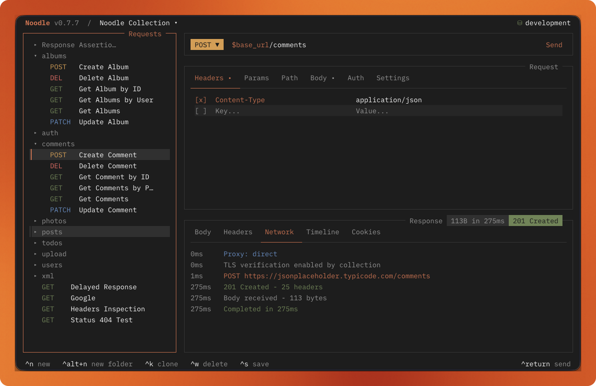

Noodle has always kept the request in the repository. Version 0.8.0 brings the expected response into that same workflow, so an automated run can do more than report what the server returned. It can decide whether the result is useful.

This release also makes collection runs more focused and adds a Claude Code theme to the terminal. Together, these changes make the same collection easier to use while developing, checking a small change, or running a broader automation job.

## Assertions live beside the request

Requests can now declare an `assert` block in YAML:

```yaml
name: Get User
method: GET
url: $base_url/users/:userId
assert:
  - expression: status
    operator: equals
    value: 200
  - expression: body.id
    operator: isNumber
  - expression: headers.Content-Type
    operator: contains
    value: application/json
  - expression: response.time
    operator: lt
    value: 500
```

The expressions cover HTTP status, response time, case-insensitive headers, and JSON body paths with properties or array indexes. Operators cover existence, type and null checks, equality, numeric comparisons, string or array containment, and a deliberately restricted regular-expression subset.

Assertions are evaluated by `noodle request run` and `noodle collection run`. A failed check makes the request fail, contributes to the collection summary, and produces a nonzero exit status. Human output shows the expression, operator, and failure message without printing raw actual values. JSON output keeps the structured expected and actual values for automation.

Expected string values can use environment variables at any depth. Noodle redacts expected values that resolve from declared secrets, while actual response values remain server data. That distinction keeps credentials out of results without pretending that an API response is safe to publish.

## Run only the requests that matter

`collection run` still runs the whole collection when no target is supplied. It can now accept any mix of request IDs and folder paths:

```bash
noodle collection run ./my-api auth/ health users/get --env staging --json
```

A folder target ends in `/` and includes its nested requests. Noodle validates every target before the first send, removes overlap, and runs the final selection once in collection order. The result is a smaller command when a change only touches one workflow, without introducing a separate runner or another collection format.

## A Claude Code palette

The theme picker now includes `claude-code`, bringing the warm orange, lavender, muted green, and dark neutral palette into Noodle's shared theme roles. It uses the same pane, border, selection, syntax, and status tokens as every other theme, with contrast checks for the colors that carry state.



This brings the built-in catalog to 34 themes. The Noodle theme remains the default, and existing saved choices remain unchanged.

## Files that can answer back

The first assertion release is intentionally declarative. There is no script runtime to configure and no second test file to keep synchronized. The request, its environment references, and its expected response remain reviewable together.

See the [collection format reference](/docs/reference/collection-format/#response-assertions) for every expression and operator, the [Automation guide](/docs/guides/automation/) for selective runs, and the [theme reference](/docs/reference/theming/) for the complete catalog.
