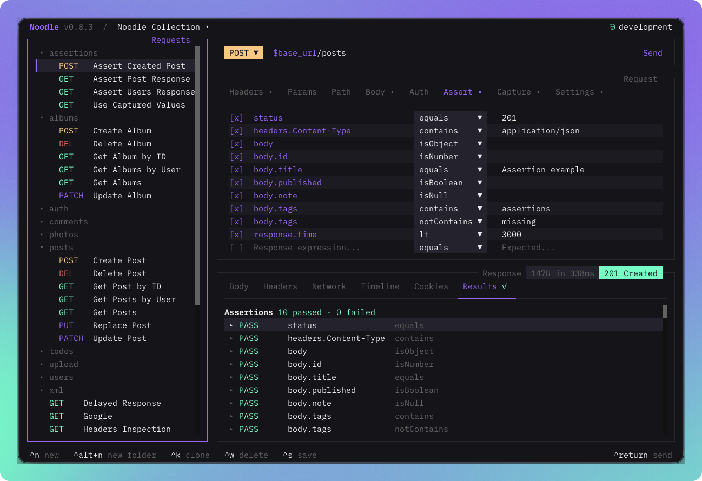
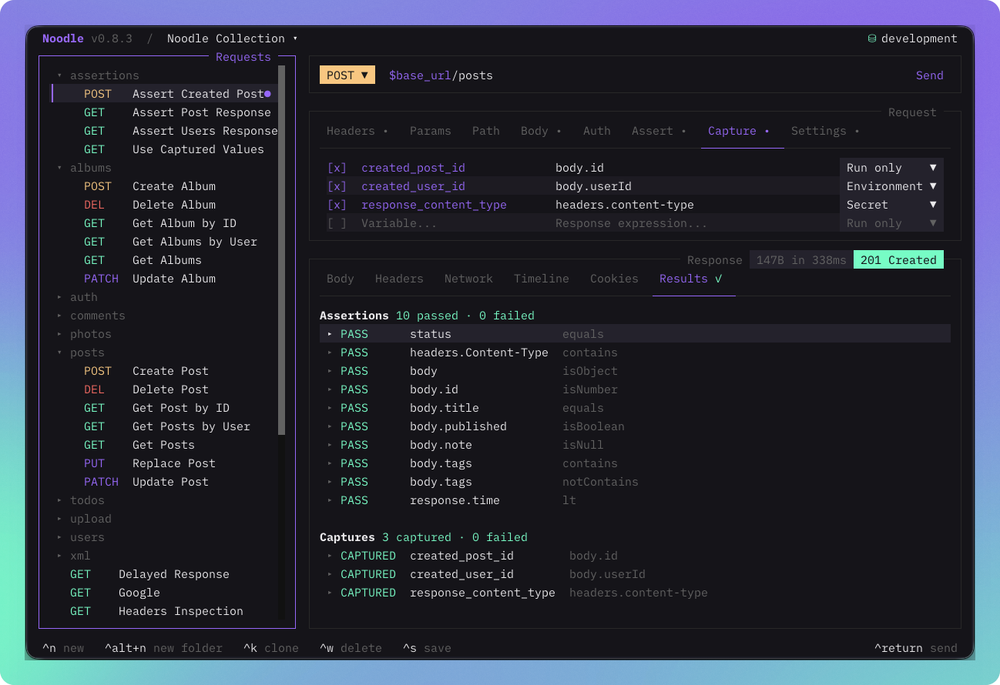
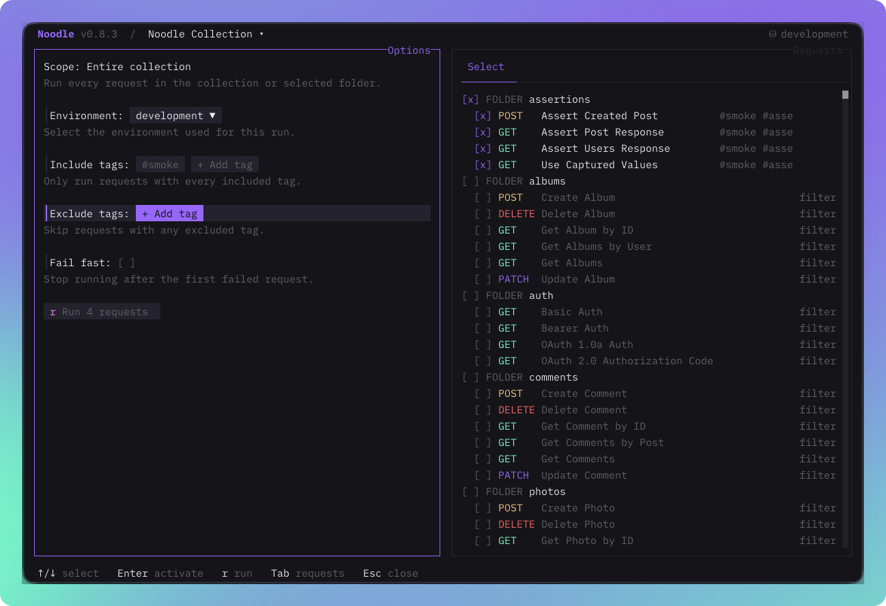

Noodle 0.8.0 put response assertions beside each request. Version 0.8.1 let
requests pass response values forward, and 0.8.2 turned tags into reusable
suites. Noodle 0.8.3 brings those pieces into one keyboard-first TUI workflow:
author the outcome, send the request, inspect the result, or run a selected part
of the collection without switching tools.

## Author the outcome beside the request

The request pane now has dedicated **Assert** and **Capture** tabs. Assertion
rows combine a response expression, operator, and expected value. Capture rows
combine a variable name, response expression, and persistence choice. Both use
the same add, edit, delete, mouse, and per-row enable behavior as the familiar
request fields.

Expression completion comes from the current response or the latest retained
timeline response. Start with `status`, `response.time`, `headers`, or `body`,
then narrow toward a field without memorizing the whole path.



Tags stay in Settings. The editor suggests tags already used by the collection,
supports direct deletion, and keeps inherited folder tags visible in request
search.

## See manual results immediately

Every manual send evaluates enabled assertions and captures with a fresh
RunScope. The **Results** tab is always the final response tab, and its symbol
shows whether the latest outcomes passed, failed, or could not be evaluated.
Open a row to inspect the expression, expected and actual values, or the captured
type and value.

Captures can stay run-only or persist after an individual manual send or CLI
`request run`:

```yaml
capture:
  user_id:
    value: body.id
  access_token:
    value: body.access_token
    persist: secret
  optional_trace:
    value: headers.x-trace
    enabled: false
```

Version 0.8.3 uses this uniform object form for every capture. `value` is
required, while `enabled` and `persist` are optional. Secret captures use the OS
vault and are fully redacted from capture results. Plaintext persistence refuses
to replace an existing secret, and failed writes leave the HTTP response
available for inspection.



## Run a collection without another runner file

Choose **Run Collection** from the command palette, or run a folder from its
context menu. The transient Runner lets you select requests and folders, choose
an environment, add Include and Exclude tags, and enable fail-fast. It shows
progress during execution, then reuses the same expandable result rows for
responses, assertions, and captures.



The Runner does not create a profile or duplicate request declarations. Its
captures stay transient, its results remain in memory, and it follows collection
order. Repeated Include tags use AND matching; repeated Exclude tags use OR
matching, so the TUI and CLI now share the same suite rules.

## Smaller edges, clearer feedback

Response expressions now match header names case-insensitively and complete
from retained timeline data. Request changes no longer leave a stale response on
screen. Long Select menus and new-request folder lists scroll within a bounded
area, overlays keep keyboard priority, and collection runs apply folder
overrides consistently.

See [Using the Request Pane](/docs/guides/using-the-request-pane/) for authoring,
[Using the Response Pane](/docs/guides/using-the-response-pane/) for Results,
and [Automation](/docs/guides/automation/) for Runner and CLI execution rules.
