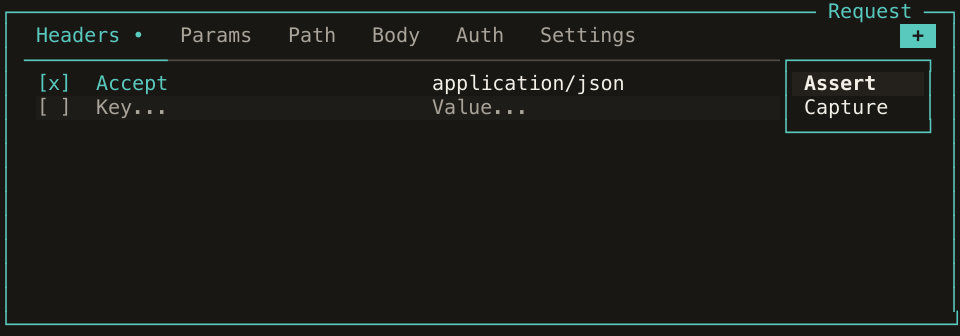

Noodle 0.8.5 adapts to more of the setup you already have. OAuth 2 can discover
its endpoints from your identity provider, a new System theme follows your
terminal's colors, and the request pane keeps empty Assert and Capture tabs
behind a compact menu. This release also improves secret redaction and makes
automation failures easier to diagnose.

## Let the identity provider supply its endpoints

An OIDC provider already publishes the authorization and token URLs a client
needs. Noodle can now read that document when an OAuth 2 request is missing an
endpoint:

```yaml
auth:
  type: oauth2
  grant_type: client_credentials
  discovery_url: https://identity.example.com
  client_id: $oauth2_client_id
  client_secret: $oauth2_client_secret
  scope: read:users
```

In the request or folder Auth editor, set **Discovery URL** to the issuer and
leave **Discovery URL Type** as `issuer`. Noodle also accepts the standard
`/.well-known/openid-configuration` URL. For a provider that serves metadata at
a custom path, choose `document` to request that exact URL.

Explicit authorization and token URLs still take precedence. OpenAPI import and
export support `openIdConnect`, including Noodle's grant and URL-kind metadata.
OpenAPI rejects partial endpoint overrides it cannot preserve, and Postman
export requires explicit endpoints for the selected grant.

## Keep the request pane focused

A request without checks or captures now shows the tabs it uses. Empty **Assert**
and **Capture** tabs live behind **+** at the end of the tab bar. Reveal either
from the menu and it stays available for that request during the session;
populated tabs remain visible automatically.

Keyboard access stays direct. Press **g** then **o** to focus the menu and
**Return** to open it, or use **g** then **v** for Assert and **g** then **c** for
Capture. Arrow navigation skips hidden tabs, and the inline body editor stays
inside its pane.



## Follow the terminal palette

Open the theme picker with **Ctrl+T** and choose **system**. Noodle uses your
terminal's foreground, background, and ANSI colors, then refreshes when the
terminal reports a theme change. If palette detection is unavailable, it uses
Noodle colors while keeping System as your saved choice.

Selected rows in the theme, command, request, and collection pickers also choose
a readable foreground when the primary color is dark.

## Keep known secrets out of new history

Structured run output and newly saved timeline entries now redact known secrets
from response headers and bodies as well as request data. This covers request
credentials, OAuth tokens and signatures, cookies, and known secret captures.
Sensitive headers such as `Set-Cookie` are masked, and bodies are redacted before
being compressed into timeline sidecars.

Captures from sensitive response headers are treated as secret. Secret capture
expressions also mask overlapping capture and assertion results, while unrelated
public numbers, booleans, and null values keep their types.

Redaction happens when a new entry is saved. Marking a variable secret or
updating a stored secret no longer rewrites existing history. Clear older
entries if they contain data you no longer want to retain, and continue treating
JSON output and timeline files as sensitive: unknown server data remains visible.

## Make failures easier to act on

`request run` now returns exit code **2** for configuration failures before
execution, matching collection runs. Completed request failures still return
**1**. Human output names the failure category, and invalid capture or assertion
errors include the supported syntax.

Literal dollar signs survive OAuth discovery and token requests without another
substitution pass. Generated code decodes dollar escapes once, and saving YAML
preserves numeric-looking capture variable names.

The bundled skills have been reviewed alongside these changes. `noodle-use`
covers discovery, typed checks, chaining, failure output, and redaction boundaries;
`noodle-dev` covers the corresponding execution and UI behavior. The OpenTUI
reference examples and runtime guidance have also been refreshed.

See [Authentication](/docs/guides/authentication/),
[Using the Request Pane](/docs/guides/using-the-request-pane/),
[Themes](/docs/reference/theming/), and [Timeline](/docs/reference/timeline/)
for the current workflows.
