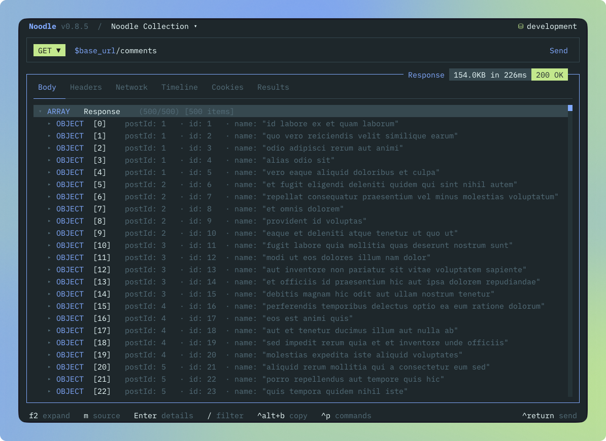
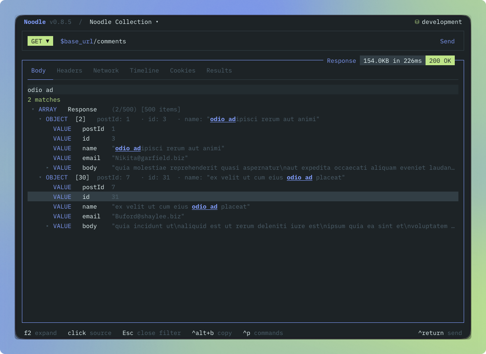

Noodle 0.8.6 gives response inspection another view. Explore JSON and XML as
expandable rows, scan compact previews, and search for a value without writing a
query. You can also hide the sidebar when the response needs more space.

## Explore the structure

Focus the response **Body** tab and press **m**, or click the footer action, to
switch from **Source** to **Visual**. Objects and arrays become expandable rows
with previews of their contents. Data that fits a table uses compact columns,
while nested structures remain available to explore one level at a time.

Use **↑** and **↓** to select a row, then **Return**, **Space**, or a click to
expand it. JSON and XML share the same browsing controls, so moving between API
formats does not mean learning another viewer.

Source remains available from the footer whenever you need the response text.
Copying from Visual returns the original response body, including content hidden
inside collapsed rows.

## Find a value in context

Press **/** in Visual and type part of a label or value. Search is literal and
case-insensitive, with matches highlighted inside the surrounding structure.
You can see which object a value belongs to without scanning the entire response.

Press **Escape** to clear the filter. Source retains JSONPath filtering for
selecting values with an expression. The footer keeps the view and copy actions
available while inspecting search results.

## Give the response more room

Press **Ctrl+B** or choose **Toggle Sidebar** from the command palette to hide
or show the main sidebar. Tab navigation skips it while it is hidden. When you
need the request tree again, **g** then **s** reopens and focuses it.

Thanks to [@cturner8](https://github.com/cturner8) for contributing the sidebar
toggle in [#218](https://github.com/wilfredinni/noodle/pull/218).

The default shortcut for copying a response body is now **Ctrl+Alt+B**. Copying
a cookie uses the same updated shortcut in the cookie jar.

The README, in-app tips, and agent references now cover these controls. See
[Using the Response Pane](/docs/guides/using-the-response-pane/) and
[Keybindings](/docs/reference/keybindings/) for the full workflow.
