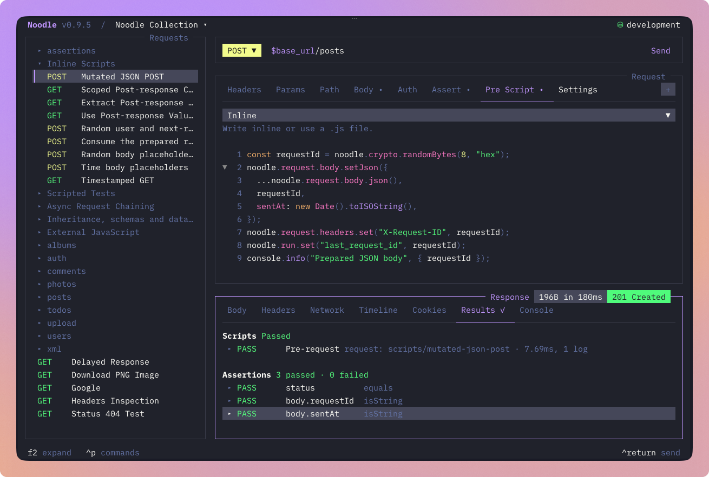
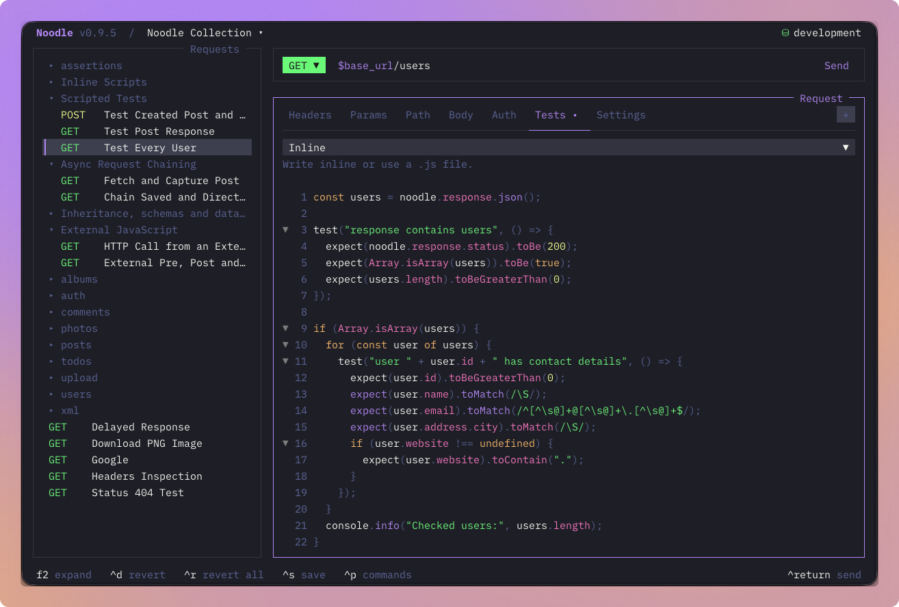
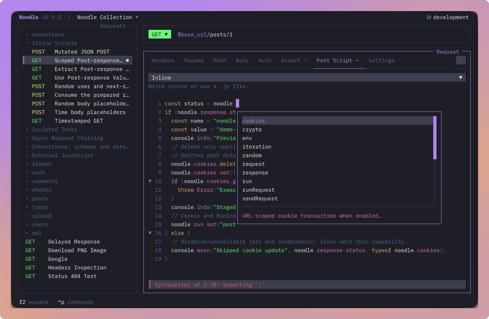
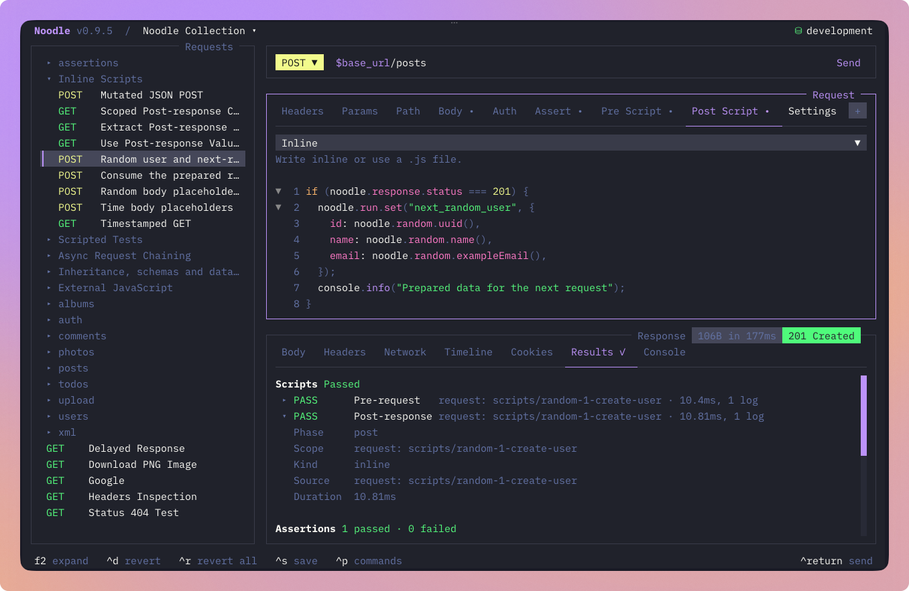
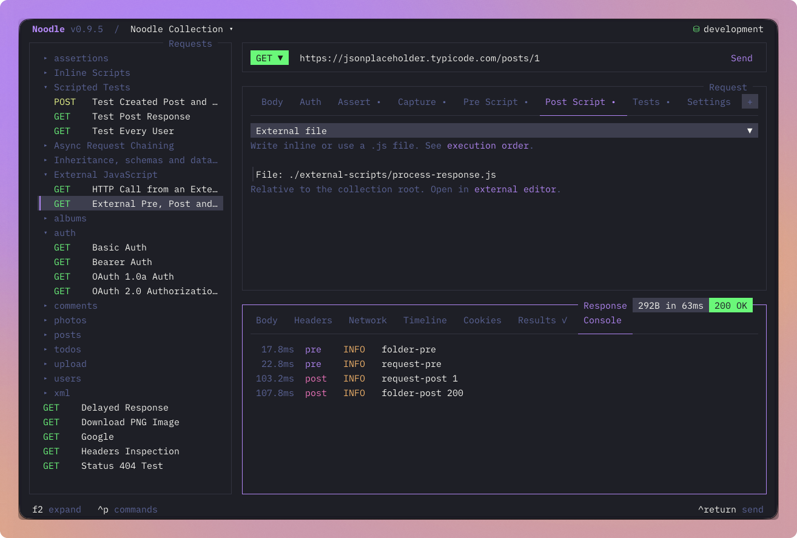

Noodle 0.9.5 brings script and test authoring into the terminal. Dedicated
editors help you find the right API, check the code as you write, and follow
logs after a send. The same workflow works across requests, folders, and
collection settings.

## Edit scripts where you use them

Reveal **Pre Script**, **Post Script**, or **Tests** from a request or folder's
**+** menu. Tabs with source already stay visible. The inline editor provides
JavaScript highlighting, line numbers, scrolling, folding, and undo/redo through
the same editor used for request bodies and YAML.

Save request and folder changes with **Ctrl+S**. For collection-wide code,
open **F4 → Collection → Scripts**. Those drafts save when you leave the editor
or change phases. Collection switches, delayed saves, and failed writes retain
the draft's original collection and preserve changes for retry.

Use **Ctrl+G** to fold JavaScript blocks. Jump mode adds **g**, then **d**, **f**,
or **j** for visible Pre Script, Post Script, and Tests tabs. Buffered navigation,
source-selector focus, and tab scrolling stay consistent as the terminal resizes.

## Find APIs and catch mistakes as you type

Completion follows the current script phase. It suggests `noodle.*` APIs,
JavaScript built-ins, local symbols, active environment keys, and saved request
IDs. Method descriptions and parameter help make it easier to fill a call
without leaving the editor. **Ctrl+Space** requests assistance explicitly.

Syntax and semantic diagnostics identify problems at their source position
without running the script. Semantic advice can catch an unknown API or an
argument with the wrong type. It remains advisory: runtime validation still
owns execution. TUI Send and Runner check applicable sources for syntax errors
before HTTP; CLI runs retain their existing execution semantics.

For external editor assistance, the installed agent skill now includes generated
`noodle-script.d.ts` declarations and phase-specific interfaces derived from the
runtime API contract.

## Format code without changing its values

Press **Ctrl+Alt+F**, or choose **Format Code**, to format inline JavaScript or
a JSON request body. Turn on **Format on save** in global **Behavior** settings
to apply it through ordinary request, folder, and collection saves.

Formatting preserves JSON number tokens and leaves body templates unevaluated.
External files, XML, and invalid source stay unchanged. Format on save is off by
default. It applies visible edits only after persistence succeeds, protects
newer drafts, and warns if the formatter is unavailable while allowing the
unformatted code to save.

## Follow external files and inherited order

Choose **External file** to enter a collection-relative `./path/to/file.js`.
Path completion suggests directories and JavaScript files. **Ctrl+Alt+X** opens
the validated file in your configured editor; Noodle does not create or rewrite
it. Switching between inline and external source asks before discarding
non-empty content.

On a request script tab, **Ctrl+Alt+R** shows the active phase's execution order
across collection, folders, and request. It makes inherited code easier to
inspect while retaining the established pre, post, and test order.

## Read logs in Console

The response **Console** appears when scripts or tests produce logs. Rows show
phase, level, and elapsed time relative to request execution. Scroll through the
bounded, redacted messages and choose **Copy Console** from the command palette
with Console focused. **g**, then **z** jumps to it when visible.

Runner and timeline details share this view. Results keeps outcomes and source
diagnostics, while history retains its existing bounded logs. Console adds no
separate history store.

## Keeping the editor responsive

This release preserves syntax colors while highlights refresh and improves
folding, cursor movement, selection, and completion dismissal. Diagnostics can
recover after a timeout, and the editor stays usable when JavaScript folding
exceeds its size or parser limits. Standalone
builds bundle the diagnostics worker and compatible type libraries, with CI
and release integration checks. OpenTUI also moves to 0.5.12.

The maintained `noodle-use` and `noodle-dev` skills now cover authoring,
formatting, Console behavior, and the shared implementation paths. The OpenTUI
skill reference was refreshed alongside its dependency update.

Start with [Scripting](/docs/guides/pre-request-scripting/#author-scripts-in-the-tui),
see the [Code editor guide](/docs/guides/code-editor/), or read the
[full changelog](https://github.com/wilfredinni/noodle/blob/main/CHANGELOG.md).
