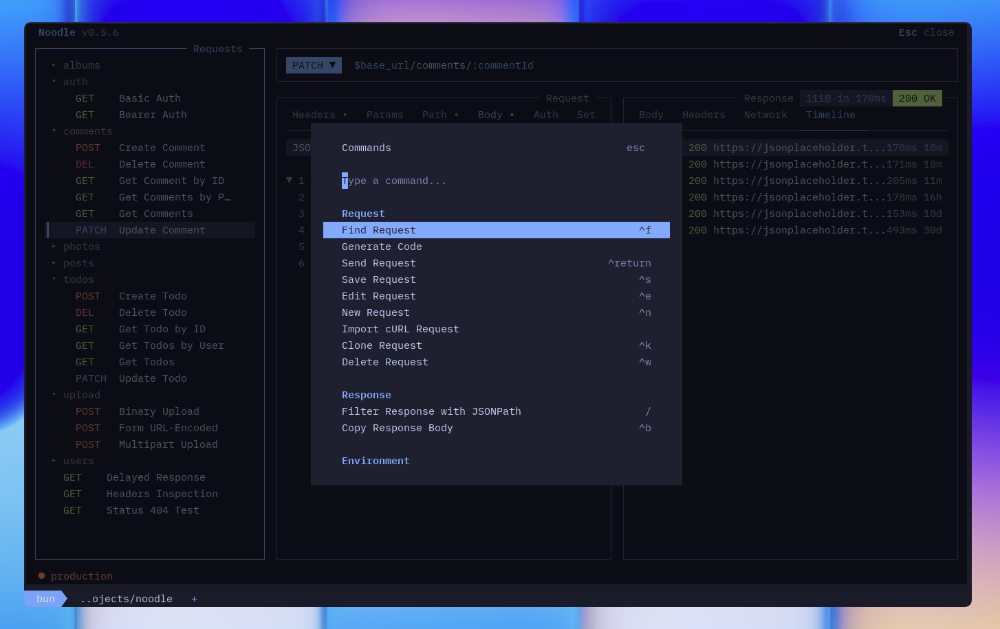

The `noodle` command can open the interactive client or perform collection work
without leaving the shell. Start with the TUI, then reach for the subcommands
when a task needs to be scripted or repeated.



## TUI (default)

Launches the terminal interface.

```bash
noodle                                  # first registered collection, or current directory
noodle .                                # open current directory
noodle --collection ./api --env prod    # explicit collection + env
noodle -c ./my-requests -e staging      # shorthand
noodle --collection ./api --noproxy     # force direct connections
noodle --collection ./api --insecure    # disable TLS verification once
```

A positional `<path>` overrides `--collection`; supplying both is invalid.
Without either, Noodle uses the first existing collection registered in
`~/.config/noodle/config.yml`, falling back to the current directory.

### Path modes

Existing collection roots open in full collection mode. Directories that
contain request `.yml` files but no collection markers (`.environments/`,
`settings.yml`) open in read-only **browse** mode. Empty directories open in
read-only **empty** mode. Use the command palette (`Ctrl+P`) to initialize
browse or empty directories before editing or sending.

| Flag           | Short | Default         | Description                                            |
| -------------- | ----- | --------------- | ------------------------------------------------------ |
| `--collection` | `-c`  | `./collections` | Path to request directory                              |
| `--env`        | `-e`  | None            | Environment to activate. Exits with error if not found |
| `--noproxy`    |      | `false`         | Force direct connections for this invocation           |
| `--insecure`   |      | `false`         | Disable TLS certificate verification for this invocation |

`--help` and `--version` are available on every command.

## Import

Converts an OpenAPI 3.0 or Swagger 2.0 specification, Postman collection, or
Insomnia v4/v5 JSON export into noodle `.yml` files.
Format is auto-detected from file contents.

```bash
noodle import ./api-spec.json                           # auto-detect
noodle import ./postman_collection.json -i postman      # force format
noodle import ./insomnia-export.json -i insomnia        # force format
noodle import ./spec.json -o ./my-apis                  # custom output dir
```

| Argument | Description                      |
| -------- | -------------------------------- |
| `source` | OpenAPI/Swagger JSON or YAML spec, or Postman/Insomnia JSON export |

| Flag       | Short | Default         | Description            |
| ---------- | ----- | --------------- | ---------------------- |
| `--format` | `-i`  | auto-detect     | `openapi`, `swagger`, `postman`, or `insomnia` |
| `--output` | `-o`  | `./collections` | Output directory       |

After writing the collection, import canonicalizes each request's YAML and
pretty-prints valid JSON bodies. Its JSON result includes the number of
formatted bodies in `data.formattedJsonBodies`.

### Import in the TUI

From an open collection, press `Ctrl+P` and choose **Import Collection**. Pick
whether the source should become a new collection or be added to the current
one. Save pending changes before choosing the current collection.

## Export

Exports a Noodle collection as an OpenAPI 3.0.3 document or Postman Collection
v2.1 bundle.

```bash
noodle export ./collections --format openapi --output ./specs/openapi.yml
noodle export ./collections --format postman --output ./exports/postman --json
```

| Argument | Description |
| -------- | ----------- |
| `collection` | Noodle collection directory |

| Flag | Short | Description |
| ---- | ----- | ----------- |
| `--format` | | `openapi` or `postman` |
| `--output` | `-o` | Output file for OpenAPI, or new/empty directory for Postman |

The output path must be outside the collection. OpenAPI includes enabled
parameters and headers, supported auth, request-body examples, folders as
tags, and enabled nonempty environment `base_url` values as servers. Postman
creates `collection.postman_collection.json` plus a redacted environment file
for every Noodle environment. Literal request values are preserved in both
formats, so review exports for secrets before sharing them.

### Export in the TUI

Press `Ctrl+P` and choose **Export Collection** to select OpenAPI or Postman
and preview the output target. When the usual Postman target directory is
occupied, the TUI chooses the next numbered directory.

## Update

Updates noodle to the latest version. Homebrew installs run `brew upgrade noodle` instead. Standalone binaries use Noodle's update manifest and verify the downloaded SHA-256 checksum before replacement.

```bash
noodle update
noodle update --force       # bypass the one-hour release-check cache
noodle update --json        # emit one JSON result envelope
```

Non-Homebrew installs cache validated release metadata for one hour. If the
manifest is temporarily unavailable, Noodle can use a valid cached release for
up to seven days. When a managed `noodle-use` skill is already installed, a
successful standalone, Homebrew, or TUI update refreshes it with the new
Noodle version. Skill refresh failure does not roll back the Noodle update and
reports `noodle agent install` as the retry.

## Agent skill

Installs or updates Noodle's embedded `noodle-use` skill without a network
request:

```bash
noodle agent install
noodle agent install --json
noodle agent install --force
```

The command writes the managed copy to `~/.agents/skills/noodle-use` and links
detected Claude, Cursor, Codex, and OpenCode skill directories to it. It refuses
to replace unmanaged directories at those paths and reports all conflicts before
changing anything. Use `--force` only when every reported copy should be
replaced; the installer keeps backups until all targets succeed and rolls back
completed replacements if a later target fails. JSON mode returns the action,
managed path, and linked paths in one result envelope.

## Automation

Noodle's non-interactive commands let scripts, CI jobs, and coding agents
create, inspect, audit, and run collections without opening the TUI.

The [Automation guide](/docs/guides/automation/) covers selective request and
folder targets, response assertions, JSON results, exit statuses, secrets, and
the full collection workflow. Use `noodle <command> --help` when you need the
complete options for one command.
