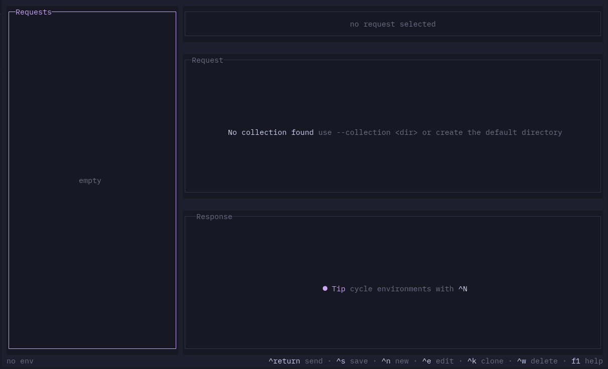
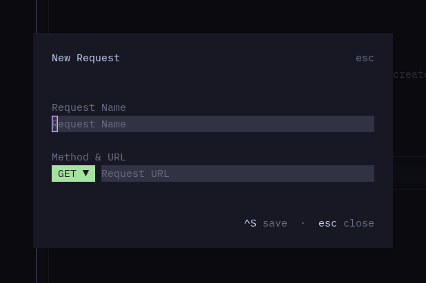
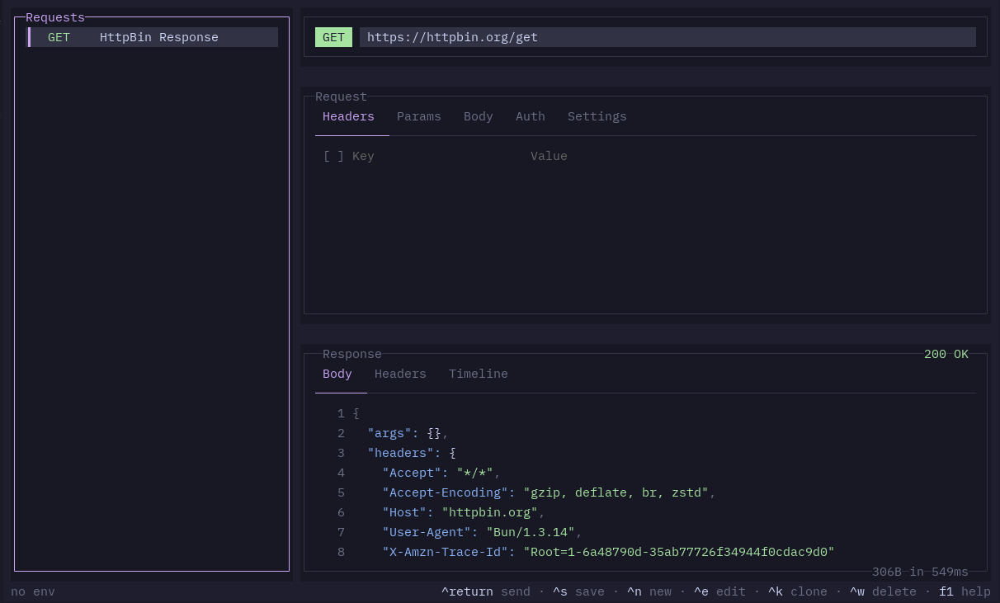

import { Image } from 'astro:assets';
import noodleCatppuccin from '../../../../assets/noodle-catppuccin.png';


<Image src={noodleCatppuccin} alt="Quick Start" loading="eager" fetchpriority="high" />

Launch the TUI (no setup needed):

```bash
noodle
```

This opens an empty workspace. The default collection directory
(`./collections`) is created automatically when you save your first
request.



Press **Ctrl+N** to open the new request overlay. Enter a name, method, and
URL, then press **Ctrl+S** to save.



Try it with a simple GET:

```
Name:       Example Request
Method:     GET
Request URL: https://httpbin.org/get
```

Press **Ctrl+Return** to send. The response pane shows the status code,
headers, body, and timing.



## What just happened?

Noodle wrote a `.yml` file on disk at `./collections/example-request.yml`.
Every request is a file — edit it directly, commit it to version control,
or share it with your team.

## Next Steps

- Add [environment variables](/guides/environments/) with `{{var}}` syntax
- Configure [authentication](/guides/authentication/) for your APIs
- Explore the [keybindings](/reference/keybindings/) reference
