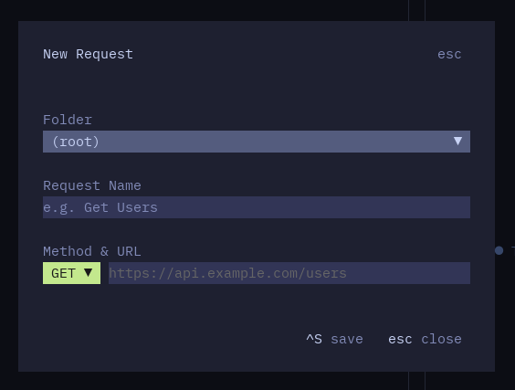
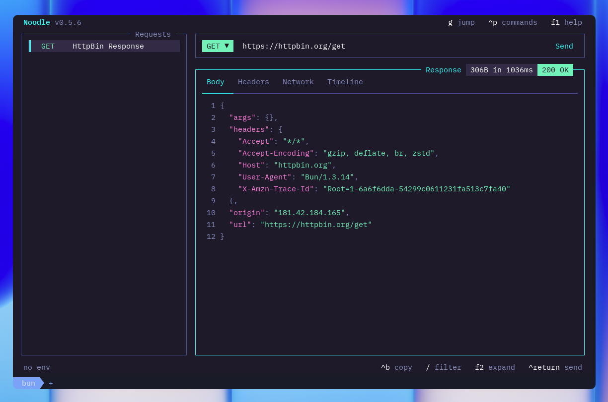

You will create a collection named `my-api`, save a GET request, and inspect
its response. [Install Noodle](/docs/getting-started/installation/) first.
This example calls the public httpbin service and needs internet access.

## Create and open a collection

In a directory where you keep API work, run:

```bash
noodle collection create my-api
noodle ./my-api
```

The first command creates `my-api`, a starter `example.yml`, a `development`
environment, and collection settings. It also registers the collection.
The second command opens that exact directory in the TUI.

If `my-api` already exists, open it with `noodle ./my-api`. If it opens in
read-only browse or empty mode, press **Ctrl+P** and choose
**Initialize Collection** before creating or sending requests.

Bare `noodle` opens the first existing registered collection, or the current
directory when none is available. It does not always open an empty workspace.

## Create a GET request

1. Press **Ctrl+N** to open **New Request**.
2. Keep the request at the collection root and enter these values:

   | Field | Value |
   | --- | --- |
   | Request Name | `Example Request` |
   | Method | `GET` |
   | URL | `https://httpbin.org/get` |

3. Press **Ctrl+S** to save.



## Send and inspect

Press **Ctrl+Return** or click **Send**. A successful call shows status `200`,
response headers, timing, and a JSON body in the response pane.

Focus the response pane and select **Headers** to inspect headers, or **Body**
to read the returned JSON. Press **F1** for keyboard help at any time.
If the request fails, use the **Network** tab and
[Troubleshooting](/docs/guides/troubleshooting/#a-request-fails-before-a-response).



## What just happened?

Your request is saved at `./my-api/example-request.yml`. Its request ID is
`example-request`, the path relative to the collection without `.yml`.
You can edit the file directly or keep using the TUI.

To send the same saved request from the CLI:

```bash
noodle request run example-request --collection ./my-api
```

## Next Steps

- [Learn layout and navigation](/docs/reference/layout/) to move between panes.
- [Add environments and secrets](/docs/guides/using-environments/) to reuse URLs and credentials.
- [Configure authentication](/docs/guides/authentication/) for a protected API.
