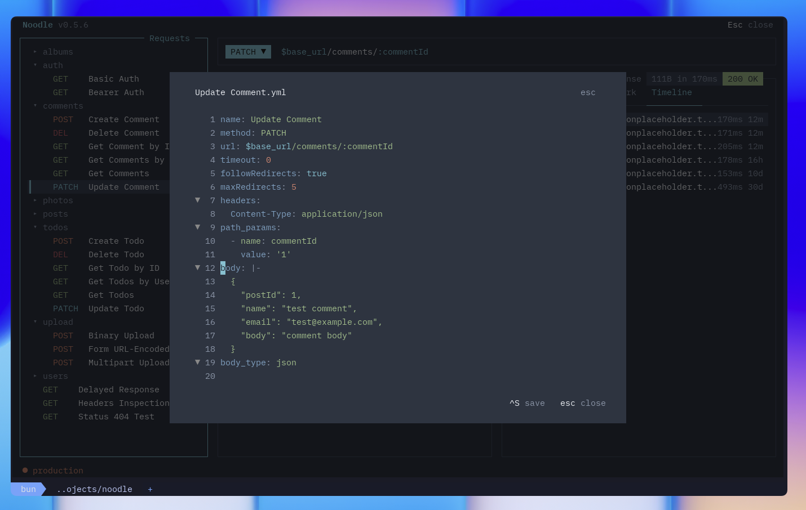
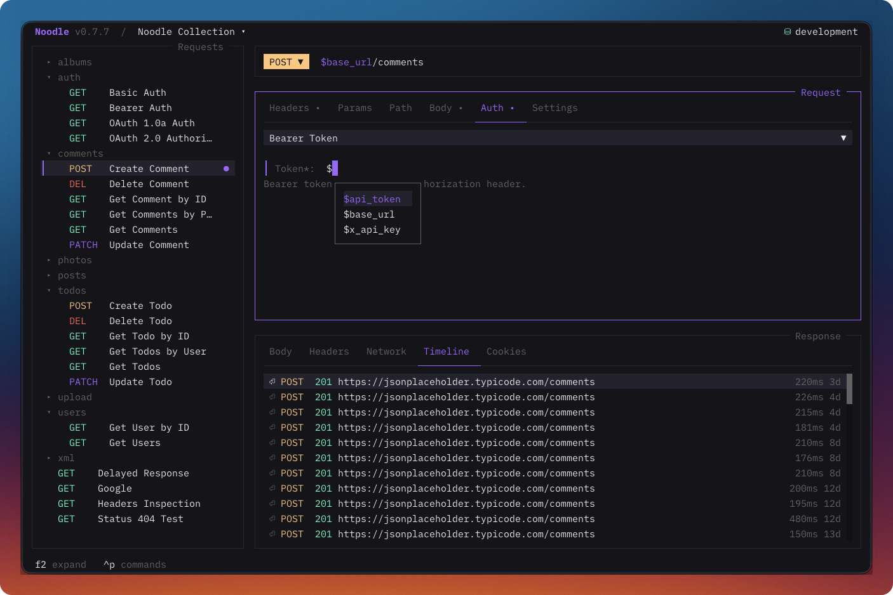

noodle includes a built-in code editor with Tree-sitter syntax highlighting
and code folding for JavaScript scripts and tests, JSON and XML bodies, and YAML request files.

## JSON Body Editor

JSON request bodies stay visible in the editor while browsing and editing.
Press **Return** on the body field to edit it. The editor provides syntax
highlighting with line numbers. Variable references (`$var`) are highlighted
with color-coded states: resolved variables in your active theme's primary
color, and missing variables in your theme's error color.

Invalid JSON shows an inline validation notice with a source line and column.
When environment variables are substituted, errors still map back to the
request source and identify an invalid variable value when applicable.

## JavaScript script and test editors

Request and folder **Pre Script**, **Post Script**, and **Tests** tabs, plus
**Collection Settings → Scripts**, use the same editor with JavaScript syntax
highlighting, line numbers, scrolling, folding, and undo/redo. Reveal empty
request or folder tabs from **+**. Use **Return** to edit; **Escape** leaves the
editor and **Shift+Tab** moves back toward the source selector.

Completion understands the current phase's `noodle.*` APIs, JavaScript built-ins,
local symbols, active environment keys, and saved request IDs. Suggestions show
method descriptions and signatures; parameter help follows the current argument.
Press **Ctrl+Space** to request assistance explicitly. In external-file mode,
the path field completes collection-relative directories and `.js` files.

Syntax errors and advisory semantic diagnostics report source positions without
running the code. Semantic checks can identify unknown APIs, unavailable host
globals, invalid argument types, and mutations forbidden in the current phase.
They do not replace runtime validation. TUI sends and the Runner block on syntax
errors in applicable sources before HTTP; CLI execution remains unchanged.

See [Scripting](/docs/guides/pre-request-scripting/#author-scripts-in-the-tui)
for save behavior, external-editor access, and inherited execution order.

## XML Body Editor

XML request bodies use the same editor with Tree-sitter XML highlighting, code
folding, line numbers, and variable completion. Noodle does not reformat or
schema-validate XML; it sends the substituted source unchanged.

## Response Body Viewer

Response bodies use the same editor in read-only mode. JSON responses support
keyboard and gutter folding, while XML responses use XML highlighting. The
viewer keeps original source line numbers beside folded rows and shows a themed
scrollbar when the body overflows. Copying across a folded row returns the
complete original source rather than the collapsed text.

## YAML Editor Overlay

Press **Ctrl+Alt+E** to edit the raw YAML of the selected request or
`folder.yml`. The editor validates the appropriate file type before saving.
It provides:

- Syntax highlighting for YAML keys, values, strings, and comments
- `$variable` highlighting (resolved and missing)
- Code folding for nested blocks
- Variable autocompletion

## Editing pairs

Typing an opening `{`, `[`, `(`, quote, or `<` inserts its closing pair and
keeps the cursor between them. With a selection, the editor wraps the selected
text. Typing a closing character over an existing one moves past it instead of
inserting another.

## Formatting

With an inline JavaScript editor or JSON request body active, press
**Ctrl+Alt+F** or choose **Format Code** from the command palette. Formatting
preserves source values, including JSON number tokens, duplicate keys, and
unevaluated `$random` and `$time` placeholders.

Enable **F4 → Global → Behavior → Format on save** to format inline scripts,
tests, and JSON bodies through normal request, folder, and collection saves.
It is off by default. External files, XML, and invalid source remain unchanged.
Collection scripts save when you leave their editor. Visible formatting is
applied after a successful save; failed saves retain the draft, and a formatting
service failure warns while allowing unformatted source to save.

## Code Folding

Fold and unfold blocks of code to focus on what matters:

| Key      | Action                          |
| -------- | ------------------------------- |
| `Ctrl+G` | Toggle fold at the current line |
| `Ctrl+Z` | Undo editor change              |
| `Ctrl+Shift+Z` | Redo editor change         |

Bulk fold and unfold actions are configurable in Settings under **Shortcuts**
and are unbound by default. F5 opens the collection Runner.

When you edit inside a folded region, the fold auto-expands. Fold state
is preserved across content changes.

## Line Operations

`Shift+Return` inserts a newline in the code editor. Standard `Return`
behavior (commit edit, send request, etc.) is preserved; use Shift+Return
when you need multi-line input.

## Autocompletion

Type `$` in a request body or YAML editor to trigger the variable autocompletion popup.
Navigate suggestions with **up/down**, accept with **Tab** or **Return**,
dismiss with **Escape**, or click a suggestion. The scrollable menu matches
text within variable names and highlights matches. Exact completed tokens stay
intact.

In the request body editor, `$random.` and `$time.` also suggest generated
values, with descriptions, signatures, and examples. Methods requiring arguments
insert parentheses and place the cursor inside. Existing arguments are preserved.
See [body templates](/docs/guides/using-the-request-pane/#random-and-time-body-values)
for supported fields and JSON quoting. Validation and completion never generate
data; JSON validation uses safe placeholders to check the prepared structure.

## Technical Details

The editor registers Tree-sitter parsers for JavaScript, JSON, YAML, and XML. It uses
Tree-sitter highlights when available, then falls back to local JSON or YAML
tokenizers when parsing fails or yields no highlights. This fallback keeps
`$variable` references usable in JSON bodies before send-time substitution.

Syntax highlight colors are synced with your active theme. Changing themes
with `Ctrl+T` instantly updates the editor's colors.
