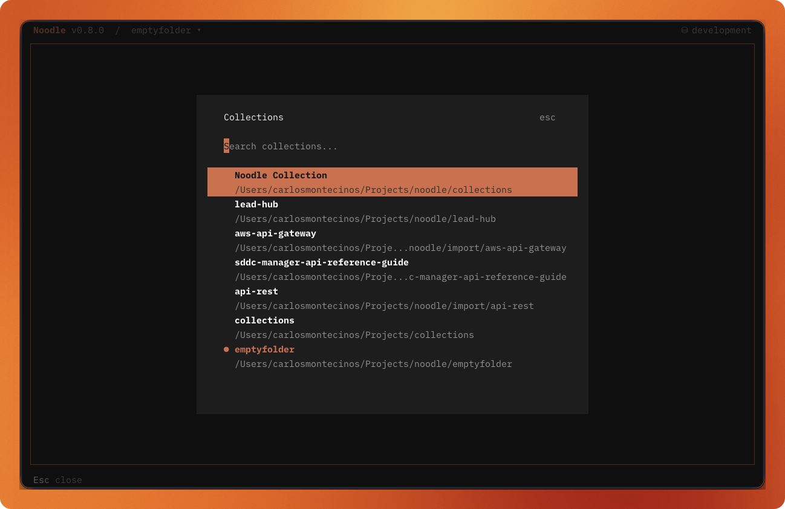
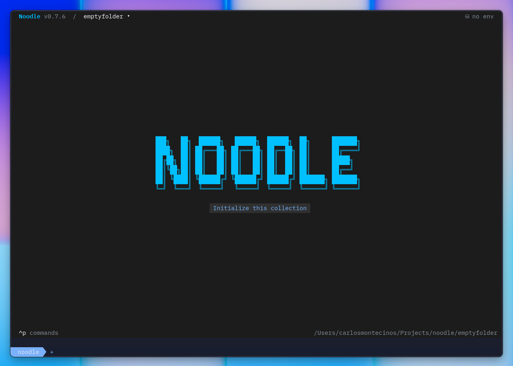

A collection is a directory of `.yml` request files. It is the unit you open,
share, version, inspect, and run.



## Directory Structure

```
my-collection/
├── .environments/
│   ├── production.env
│   └── staging.env
├── .noodle/                  # UI state (auto-generated)
├── .timeline/                # Response history (auto-generated)
├── settings.yml
├── users/
│   ├── folder.yml
│   ├── list.yml
│   └── create.yml
└── health.yml
```

The `.noodle/` and `.timeline/` directories are created automatically.
`.noodle/` stores local UI state. `.timeline/` stores response history that may
contain public variables or sensitive server payloads, so keep it out of version
control. The [Timeline](/docs/reference/timeline/) reference explains the stored
history format and redaction boundaries.

For the complete request, folder, and settings schema, see the
[Collection Format](/docs/reference/collection-format/) reference.

## Starting a collection

Create a collection from the TUI by saving a request, or create one directly
for automation:

```bash
noodle collection create my-api
noodle request create health \
  --url https://api.example.com/health \
  --collection ./my-api
```

The default TUI collection is `./collections`. A new collection directory is
created when you first save a request.



## Formatting a collection

Use the automation CLI to rewrite every request with canonical YAML and
pretty-print valid JSON request bodies:

```bash
noodle collection format ./my-api
```

This command modifies request files. Invalid JSON body text is preserved as-is.
OpenAPI, Swagger, Postman, and Insomnia imports run the same formatting automatically.

## Switching Collections

Press `Ctrl+O` to switch between previously used collection directories. The
collection switcher lists them in most-recently-used order. When you switch,
Noodle reloads the collection, environments, and UI state; unsaved drafts are
preserved per collection. Clicking the collection path in the header opens the
same switcher.


Opened collections are stored in `~/.config/noodle/config.yml`. You can also
switch collections from the Collection section of the command palette
(`Ctrl+P`).

The command palette can also open the active collection in a detected external
editor. Choose the preferred editor in Settings under global **Behavior**.

## Repairing invalid YAML

If a request or `folder.yml` file is invalid, Noodle opens a repair workspace
instead of the normal collection view. Select each invalid file, edit it with
inline YAML validation, and press **Ctrl+S** to save. Noodle reloads the
collection after a successful repair; **Ctrl+W** deletes the selected invalid
file after confirmation.

## Organizing a collection

Use folders to group related requests. A `folder.yml` can give a folder a
name and sort order, and can apply shared headers or authentication to its
children. The [Using Folders](/docs/guides/using-folders/) guide covers the
TUI workflow; the [Collection Format](/docs/reference/collection-format/)
reference defines inheritance and file fields.

## Default environment

Set a collection-wide default in `settings.yml`:

```yaml
environment: production
```

This selects the environment when you open the collection and when automation
run commands are used without `--env`.

Noodle also generates a `collection_id` in `settings.yml` when collection-scoped
vault storage is first needed. Preserve it when moving the collection so secure
environment values, proxy credentials, and mTLS passphrases remain available;
do not copy it into another collection.
