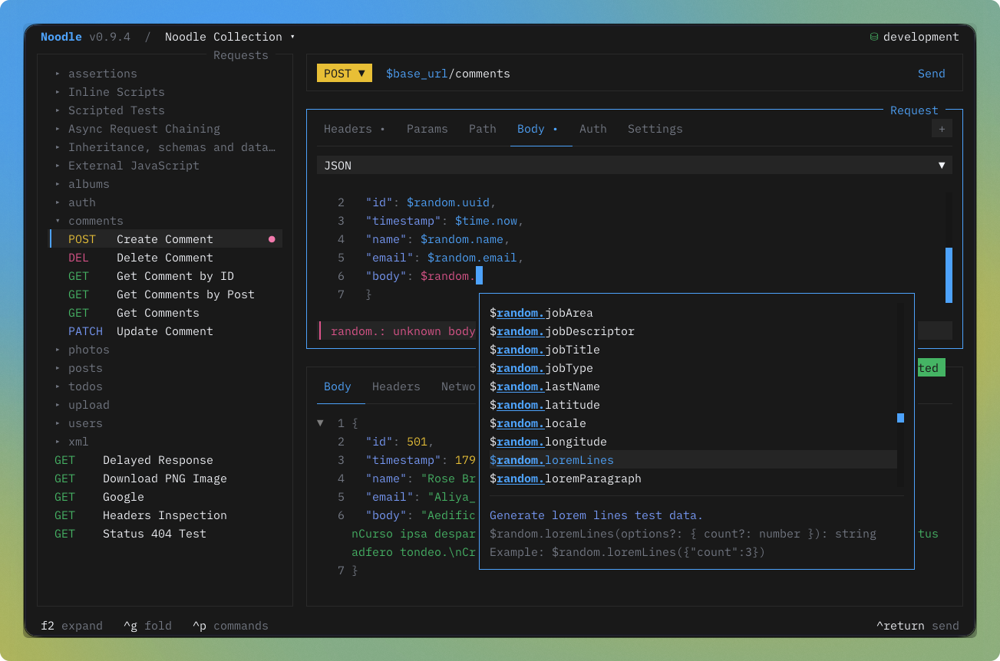
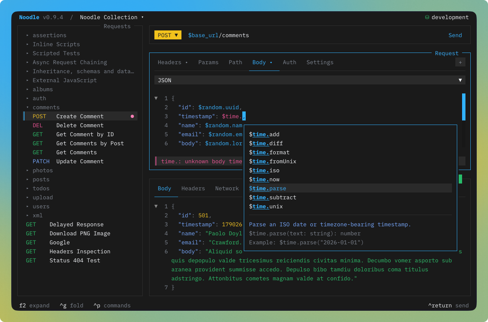

import { Image } from "astro:assets";
import noodleOwl from "../../../../assets/noodle-owl.png";

The request pane sits in the center of the TUI. It shows every detail of the
selected request: URL, method, headers, query and path params, body, auth,
assertions, captures, and settings.

## Create, edit, and send

Open an initialized collection. Press **Ctrl+N**, enter a name, method, and URL,
and save with **Ctrl+S**. For an existing request, select it from the sidebar.
Use the request tabs to edit headers, parameters, auth, and body; **Return**
edits a field and **Escape** leaves the edit. Save, then press **Ctrl+Return**
to send. Inspect the response status, body, and **Results**.

For a complete first example, follow [Your first request](/docs/getting-started/quick-start/).
Continue with [Inspect and save responses](/docs/guides/using-the-response-pane/).

<Image
  src={noodleOwl}
  alt="Request pane"
  loading="eager"
  fetchpriority="high"
/>

## Optional tabs

Empty **Assert** and **Capture** tabs stay behind the **+** menu at the right
of the tab bar. Choose a tab to reveal it; tabs that already contain declarations
are always visible. Revealed tabs remain available for that request during the
session, and already visible tabs are disabled in the menu.

Click **+**, or press **g** then **o** to focus it and **Return** to open it.
The existing **g** then **v** and **g** then **c** shortcuts reveal Assert and
Capture directly. Arrow navigation skips hidden tabs.


## Browse Mode

When the request pane is focused, arrow keys navigate between sections:

| Key         | Action                                                   |
| ----------- | -------------------------------------------------------- |
| **↑**/**↓** | Move between sections (URL, headers, params, auth, body) |
| **←**/**→** | Move between items within a section                      |
| **Return**  | Enter edit mode on the selected field                    |
| **Space**   | Toggle header, param, assertion, or capture rows          |

Disabled fields are preserved but not sent with the request.

## Headers & Params

Headers and query params are lists of key/value pairs. Both work the
same way:

| Action         | Key                           |
| -------------- | ----------------------------- |
| Add new row    | Arrow down past the last row  |
| Toggle enabled | **Space**                     |
| Edit value     | **Return** to enter edit mode |
| Delete row     | **Ctrl+D** in browse mode     |

## Path Params

The **Path** tab holds the required values for `:name` tokens in the URL. For
example, `https://api.example.com/users/:userId` has a `userId` path param.
Noodle adds and removes matching entries as you change the URL. Path params
cannot be disabled; all URL tokens must resolve before sending. Values support
environment variables such as `$user_id`.


## Edit Mode

Press **Return** on any field to edit. A cursor appears.

| Key        | Action                              |
| ---------- | ----------------------------------- |
| **Return** | Commit the edit                     |
| **Escape** | Cancel, revert field to saved value |
| **Tab**    | Move to next field                  |

## Body Types

Press **Ctrl+T** in the body section to cycle through types. Each type
shows different fields:

| Type           | Fields shown                |
| -------------- | --------------------------- |
| **none**       | No body                     |
| **json**       | JSON code editor            |
| **xml**        | XML code editor             |
| **urlencoded** | Form entries (key/value)    |
| **multipart**  | Form entries (text or file) |
| **binary**     | File path                   |

For multipart entries, **Ctrl+T** toggles between text and file mode.

## Assert and Capture

The **Assert** tab checks a response; **Capture** saves a response value for
reuse. Reveal an empty tab from the **+** menu or with **g**, then **v** (Assert)
or **g**, then **c** (Capture).

Follow [Response assertions](/docs/guides/assertions/) or
[Capture and reuse values](/docs/guides/captures/) for steps, examples, persistence,
and Results. Their exact YAML fields are in [Collection YAML](/docs/reference/collection-format/).

## Settings

Below the body section, configure request behavior:

| Setting              | Description                                           |
| -------------------- | ----------------------------------------------------- |
| **Timeout**          | Request timeout in milliseconds. `0` means no timeout |
| **Follow redirects** | Toggle automatic redirect following on/off            |
| **Max redirects**    | Maximum number of redirects to follow                 |
| **TLS verification** | Inherit the collection policy, require verification, or disable it for this request |
| **Send Cookies**     | Send matching cookies from the collection jar          |
| **Tags**             | Case-sensitive suite tags edited in an overlay          |

Disabling TLS verification weakens transport security. Prefer configuring the
required CA bundle in collection Settings; use the request override only when
the target is intentionally trusted another way.

Turning off **Send Cookies** prevents jar cookies from being added to this
request and its redirect hops. Noodle still captures response cookies into the
collection jar. Disable the jar in collection Settings when neither sending nor
capturing should occur.

Open a tag row to add or rename it with suggestions from the collection. Tags
also expose a direct delete action. The request combines its own tags with tags
from every ancestor folder.

## Variable Autocompletion

Type `$` in any text field to trigger the autocompletion popup:

| Key                  | Action                     |
| -------------------- | -------------------------- |
| **↑**/**↓**          | Navigate suggestions       |
| **Tab** / **Return** | Accept selected suggestion |
| **Escape**           | Dismiss popup              |

The popup filters available environment variables by case-insensitive matches
within their names and highlights matching text. Scroll or click to select a
suggestion. It appears at your cursor position and works in the URL bar,
header values, param values, body editor, and auth fields.


## Variable Highlighting

All input fields display `$variable` references with color-coded states:

- **Resolved**: variable exists in the active environment (theme primary color)
- **Missing**: variable not found in any environment (theme error color)

This helps you catch typos and missing environment variables before sending.

## JSON and XML Body Editor

When `body_type` is `json` or `xml`, the body field stays in the
[code editor](/docs/guides/code-editor/) while browsing and editing. Both have
syntax highlighting, line numbers, code folding, and variable completion. JSON
also has inline validation; XML is sent unchanged after variable substitution
and defaults to `Content-Type: application/xml` when no enabled Content-Type
header exists. Press **Return** on the body field to edit it; **Escape** returns
to the body-type selector without discarding the draft.

For multipart entries, **Ctrl+T** toggles between text and file mode.

## Random and time body values

Use body placeholders when a request only needs generated test data or a
timestamp. They work in JSON, text/XML bodies, and enabled text form values:

```yaml
body_type: json
body: |-
  {
    "id": "$random.uuid",
    "email": "$random.exampleEmail()",
    "age": $random.number({"min":18,"max":80}),
    "role": $random.pick(["admin","user"]),
    "active": $random.boolean,
    "createdAt": $time.iso,
    "timestampMs": $time.now,
    "timestampSeconds": $time.unix(),
    "date": $time.format("2026-01-01", "YYYY-MM-DD")
  }
```



`$random` uses the [script random catalog](/docs/reference/script-api/#script-random-api),
except `seed`; `$time` uses the [time methods](/docs/reference/script-api/#script-time-api).
Parentheses are optional when no arguments are needed. Arguments must be JSON
literals, with double-quoted strings and object keys. JavaScript expressions,
nested calls, unknown methods, and invalid options fail before that request's
pre scripts and HTTP. Argument and result values retain the 256 KiB/depth-32
limits and each helper's option limits.

In JSON, a standalone placeholder preserves the generated type. Quotes make it
text and escape it for JSON. Escape argument quotes inside JSON strings:

```json
{"label": "user-$random.pick([\"admin\",\"user\"])"}
```

Text/XML bodies insert strings literally, without XML escaping; non-string
values become compact JSON text. Form encoders escape generated text values as
usual. Generation does not apply to URLs, headers, parameters, auth, assertion
expectations, form names, file fields, or file paths. `$random.` and `$time.`
are reserved in supported body values; plain `$random` and `$time` remain
ordinary variables. Use `$$random.uuid` or `$$time.now` for literal text.

Each occurrence expands once before pre scripts on every manual send, CLI run,
Runner selection, dataset iteration, or saved child request. Current-time calls
share one instant within that request; redirects and authentication retries reuse
the prepared body. Generated random values are independent of script seeds.
Use a pre script and explicit setters to reuse a generated value across fields.
Variables, generated values, script writes, and direct `noodle.sendRequest`
inputs are never scanned again for placeholders.

Type `$random.` or `$time.` while editing a body or text form value to see
methods with descriptions, signatures, and examples. Suggestions work without
an environment and preserve existing arguments. Editing, validation, formatting,
and inspection do not generate random data or read the current clock. Saved
YAML keeps the placeholders. Generated passwords are registered for redaction;
other test data stays visible. Generators do not provide cryptographic
credentials or guaranteed uniqueness.



Try the [random body](https://github.com/wilfredinni/noodle/blob/main/collections/scripts/random-body.yml)
and [time body](https://github.com/wilfredinni/noodle/blob/main/collections/scripts/time-body.yml)
examples.

## Auth

Navigate to the auth section to set authentication:

| Auth type | Fields |
| --------- | ------ |
| **None** | No auth |
| **Inherit** | Nearest parent folder auth |
| **Bearer** | Token |
| **Basic** | Username and password |
| **NTLMv2** | Username, password, optional domain and workstation |
| **API Key** | Key, value, and header or query placement |
| **AWS SigV4** | Access key, secret key, region, service, optional session token |
| **OAuth 1.0a** | Credentials, signature method, private key, placement, and optional signing fields |
| **OAuth 2.0** | Grant, discovery URL and type, endpoints, client credentials, PKCE, token lifecycle, client assertion, and delivery fields |

Press **Return** on the type field to cycle through options.
For OAuth 2.0 requests, open the command palette to fetch or authorize, copy,
or clear the current secure token. See
[Authentication](/docs/guides/authentication/) for setup and security rules.


## Creating and Managing Requests

| Action          | Keybinding                                         |
| --------------- | -------------------------------------------------- |
| New request     | **Ctrl+N**: set name, folder, method, and URL in a modal |
| Save            | **Ctrl+S**: writes the `.yml` file                 |
| Clone           | **Ctrl+K**: duplicates the request                 |
| Delete          | **Ctrl+W**: deletes with confirmation              |
| Edit in overlay | **Ctrl+E**: rename, change method/URL, move folder |
| Edit YAML       | **Ctrl+Alt+E**: edit raw YAML in overlay           |
| New folder      | **Ctrl+Alt+N**: creates a folder                   |
| Expand pane     | **F2**: expand request pane to full width          |

The collection directory is created automatically on first save.

## Importing and Generating Code

Open the command palette with **Ctrl+P** to import a cURL command as a new
request. The importer supports the request details represented by the cURL
flags it recognizes, including headers, authentication, query parameters,
bodies, forms, uploads, redirects, and timeouts.

With a selected request, choose **Generate Code** in the command palette to
create a client snippet. Choose a language and, where applicable, a library;
press **i** to interpolate the active environment and **c** to copy the
generated snippet.

Code generation is unavailable for NTLMv2, AWS SigV4, OAuth 1.0a, and OAuth
2.0 requests because those schemes require a connection exchange,
request-specific signature, or external secure token state.

## Reverting

| Key        | Action                                                                  |
| ---------- | ----------------------------------------------------------------------- |
| **Ctrl+D** | Revert current field to last saved value                                |
| **Ctrl+R** | Revert all fields in this request                                       |
| **Ctrl+Z** | Undo all pending changes across all requests, folders, and environments |

## Sending

Press **Ctrl+Return** or **^J** to send, or click **Send** at the right end of
the URL bar. The control shows an in-place sending indicator while the request
is running, and the response appears in the response pane.
