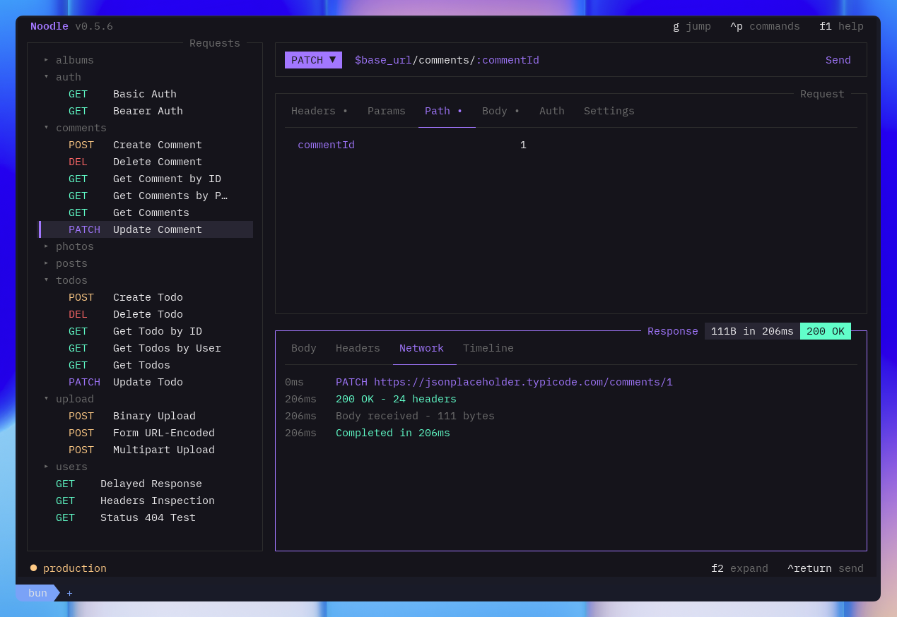
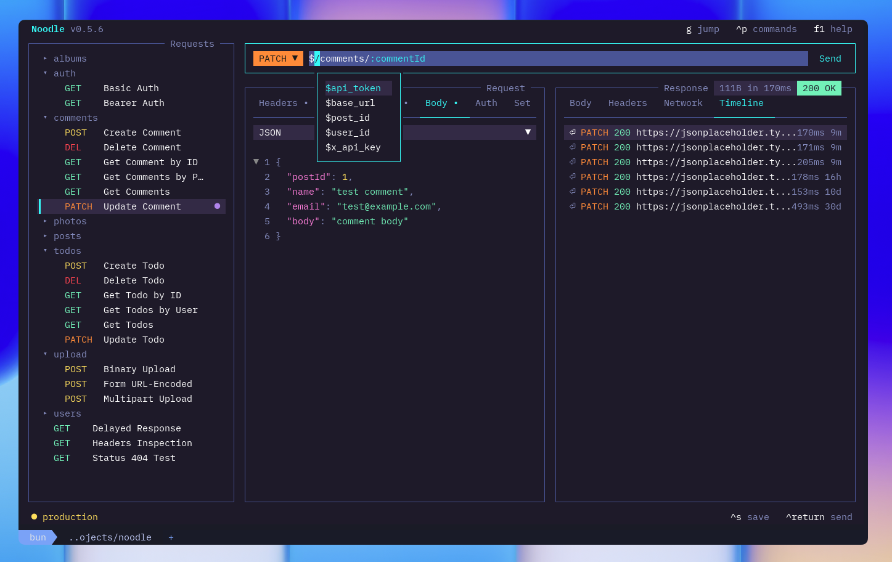
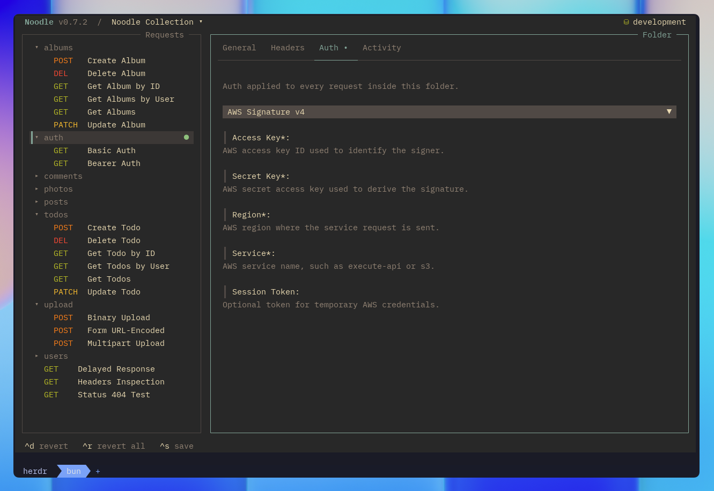

import { Image } from "astro:assets";
import noodleOwl from "../../../../assets/noodle-owl.png";

The request pane sits in the center of the TUI. It shows every detail of the
selected request: URL, method, headers, query and path params, body, auth,
assertions, captures, and settings.

<Image
  src={noodleOwl}
  alt="Request pane"
  loading="eager"
  fetchpriority="high"
/>

## Browse Mode

When the request pane is focused, arrow keys navigate between sections:

| Key         | Action                                                   |
| ----------- | -------------------------------------------------------- |
| **↑**/**↓** | Move between sections (URL, headers, params, auth, body) |
| **←**/**→** | Move between items within a section                      |
| **Return**  | Enter edit mode on the selected field                    |
| **Space**   | Toggle header, param, assertion, or capture rows          |

Disabled fields are preserved but not sent with the request.

## Headers & Params

Headers and query params are lists of key/value pairs. Both work the
same way:

| Action         | Key                           |
| -------------- | ----------------------------- |
| Add new row    | Arrow down past the last row  |
| Toggle enabled | **Space**                     |
| Edit value     | **Return** to enter edit mode |
| Delete row     | **Ctrl+D** in browse mode     |

## Path Params

The **Path** tab holds the required values for `:name` tokens in the URL. For
example, `https://api.example.com/users/:userId` has a `userId` path param.
Noodle adds and removes matching entries as you change the URL. Path params
cannot be disabled; all URL tokens must resolve before sending. Values support
environment variables such as `$user_id`.

## Edit Mode

Press **Return** on any field to edit. A cursor appears.

| Key        | Action                              |
| ---------- | ----------------------------------- |
| **Return** | Commit the edit                     |
| **Escape** | Cancel, revert field to saved value |
| **Tab**    | Move to next field                  |

## Body Types

Press **Ctrl+T** in the body section to cycle through types. Each type
shows different fields:

| Type           | Fields shown                |
| -------------- | --------------------------- |
| **none**       | No body                     |
| **json**       | JSON code editor            |
| **xml**        | XML code editor             |
| **urlencoded** | Form entries (key/value)    |
| **multipart**  | Form entries (text or file) |
| **binary**     | File path                   |

For multipart entries, **Ctrl+T** toggles between text and file mode.

## Assert and Capture

The **Assert** tab defines response checks as expression, operator, and expected
value rows. The **Capture** tab maps a variable name to a response expression
and a persistence mode. Both tabs use **Space** to enable or disable the
selected row, and disabled rows remain in the request file.

Start typing a response expression to complete fields from the current response
or the latest retained timeline response. Expressions cover status, response
time, case-insensitive headers, and JSON body paths.

Capture persistence has three choices:

| Choice | Behavior |
| ------ | -------- |
| **Run only** | Keep the value in the current RunScope |
| **Environment** | Persist an enabled plaintext value in the active environment |
| **Secret** | Store the value in the OS vault and keep only a blank secret declaration |

Manual sends and CLI `request run` honor persistence. CLI `collection run` and
the TUI collection Runner always keep captures transient. A missing active
environment or failed write appears as a capture failure without hiding the
HTTP response, and secret capture values remain redacted in Results.

## Settings

Below the body section, configure request behavior:

| Setting              | Description                                           |
| -------------------- | ----------------------------------------------------- |
| **Timeout**          | Request timeout in milliseconds. `0` means no timeout |
| **Follow redirects** | Toggle automatic redirect following on/off            |
| **Max redirects**    | Maximum number of redirects to follow                 |
| **TLS verification** | Inherit the collection policy, require verification, or disable it for this request |
| **Send Cookies**     | Send matching cookies from the collection jar          |
| **Tags**             | Case-sensitive suite tags edited in an overlay          |

Disabling TLS verification weakens transport security. Prefer configuring the
required CA bundle in collection Settings; use the request override only when
the target is intentionally trusted another way.

Turning off **Send Cookies** prevents jar cookies from being added to this
request and its redirect hops. Noodle still captures response cookies into the
collection jar. Disable the jar in collection Settings when neither sending nor
capturing should occur.

Open a tag row to add or rename it with suggestions from the collection. Tags
also expose a direct delete action. The request combines its own tags with tags
from every ancestor folder.

## Variable Autocompletion

Type `$` in any text field to trigger the autocompletion popup:

| Key                  | Action                     |
| -------------------- | -------------------------- |
| **↑**/**↓**          | Navigate suggestions       |
| **Tab** / **Return** | Accept selected suggestion |
| **Escape**           | Dismiss popup              |

The popup lists available environment variables filtered by your typed
prefix. It appears at your cursor position and works in the URL bar,
header values, param values, body editor, and auth fields.

## Variable Highlighting

All input fields display `$variable` references with color-coded states:

- **Resolved**: variable exists in the active environment (theme primary color)
- **Missing**: variable not found in any environment (theme error color)

This helps you catch typos and missing environment variables before sending.

## JSON and XML Body Editor

When `body_type` is `json` or `xml`, the body field stays in the
[code editor](/docs/guides/code-editor/) while browsing and editing. Both have
syntax highlighting, line numbers, code folding, and variable completion. JSON
also has inline validation; XML is sent unchanged after variable substitution
and defaults to `Content-Type: application/xml` when no enabled Content-Type
header exists. Press **Return** on the body field to edit it; **Escape** returns
to the body-type selector without discarding the draft.

For multipart entries, **Ctrl+T** toggles between text and file mode.

## Auth

Navigate to the auth section to set authentication:

| Auth type | Fields |
| --------- | ------ |
| **None** | No auth |
| **Inherit** | Nearest parent folder auth |
| **Bearer** | Token |
| **Basic** | Username and password |
| **NTLMv2** | Username, password, optional domain and workstation |
| **API Key** | Key, value, and header or query placement |
| **AWS SigV4** | Access key, secret key, region, service, optional session token |
| **OAuth 1.0a** | Credentials, signature method, private key, placement, and optional signing fields |
| **OAuth 2.0** | Grant, endpoints, client credentials, PKCE, token lifecycle, client assertion, and delivery fields |

Press **Return** on the type field to cycle through options.
For OAuth 2.0 requests, open the command palette to fetch or authorize, copy,
or clear the current secure token. See
[Authentication](/docs/guides/authentication/) for setup and security rules.

## Creating and Managing Requests

| Action          | Keybinding                                         |
| --------------- | -------------------------------------------------- |
| New request     | **Ctrl+N**: set name, folder, method, and URL in a modal |
| Save            | **Ctrl+S**: writes the `.yml` file                 |
| Clone           | **Ctrl+K**: duplicates the request                 |
| Delete          | **Ctrl+W**: deletes with confirmation              |
| Edit in overlay | **Ctrl+E**: rename, change method/URL, move folder |
| Edit YAML       | **Ctrl+Alt+E**: edit raw YAML in overlay           |
| New folder      | **Ctrl+Alt+N**: creates a folder                   |
| Expand pane     | **F2**: expand request pane to full width          |

The collection directory is created automatically on first save.

## Importing and Generating Code

Open the command palette with **Ctrl+P** to import a cURL command as a new
request. The importer supports the request details represented by the cURL
flags it recognizes, including headers, authentication, query parameters,
bodies, forms, uploads, redirects, and timeouts.

With a selected request, choose **Generate Code** in the command palette to
create a client snippet. Choose a language and, where applicable, a library;
press **i** to interpolate the active environment and **c** to copy the
generated snippet.

Code generation is unavailable for NTLMv2, AWS SigV4, OAuth 1.0a, and OAuth
2.0 requests because those schemes require a connection exchange,
request-specific signature, or external secure token state.

## Reverting

| Key        | Action                                                                  |
| ---------- | ----------------------------------------------------------------------- |
| **Ctrl+D** | Revert current field to last saved value                                |
| **Ctrl+R** | Revert all fields in this request                                       |
| **Ctrl+Z** | Undo all pending changes across all requests, folders, and environments |

## Sending

Press **Ctrl+Return** or **^J** to send, or click **Send** at the right end of
the URL bar. The control shows an in-place sending indicator while the request
is running, and the response appears in the response pane.
