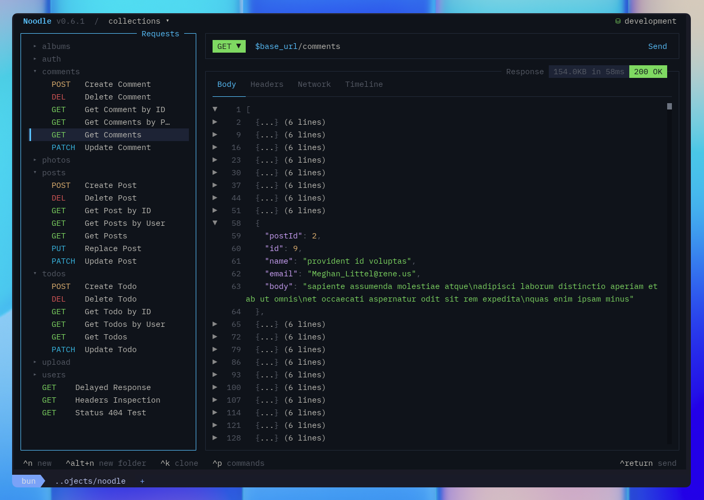
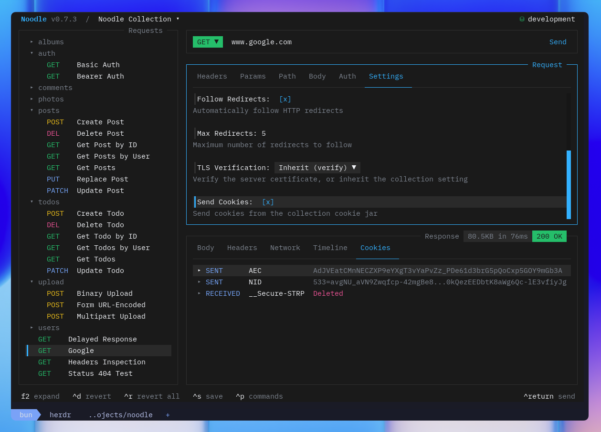

import { Image } from 'astro:assets';
import noodleOpencode from '../../../../assets/noodle-opencode.png';

The response pane shows results after sending a request: status code,
response time, headers, and body (auto-formatted if JSON).

<Image src={noodleOpencode} alt="Response pane" loading="eager" fetchpriority="high" />

## Navigation

| Key | Action |
|-----|--------|
| **←**/**→** | Switch tabs (Body / Headers / Network / Timeline / Cookies / Results) |
| **↑**/**↓** | Scroll active tab |
| **PgUp**/**PgDn** | Page scroll |
| **F2** | Expand response pane to full width |

## Tabs

| Tab | Content |
|-----|---------|
| **Body** | Source/Visual text views, supported image previews, or binary file metadata |
| **Headers** | Response headers sorted alphabetically |
| **Network** | Live request, authentication, redirect, response, and failure events |
| **Timeline** | History of every send for this request |
| **Cookies** | Cookies sent on the final request leg and received in the final response |
| **Results** | Script, assertion, and capture outcomes from the latest manual send |

The Network tab updates while a request is sending. OAuth 2 token acquisition,
refresh, and browser authorization status appear as authentication events
without exposing token values. Events are retained in timeline entries, so you
can inspect the trace again after the response is complete.

## Results

The **Results** tab is always available at the end of the response tabs. Manual
sends run pre, HTTP, captures, post, then assertions with a fresh RunScope.
Post runs for completed responses even after HTTP/capture failure; assertions
still run after post failure. When outcomes exist, the tab shows `✓` for
success, `✗` for a failed script, assertion, or capture, or `–` when an earlier
failure prevented evaluation.

Use **↑**/**↓** to select a result and **Return** or a click to expand its
details. Pre-request/Post-response rows show status, duration, log count, normalized
errors, persistence outcomes, and expandable redacted console messages. Captures show their type and redacted
value; secret-persisted captures and captures from sensitive response headers
never reveal the value. Script source, capture results, and RunScope values stay out of timeline
history. Bounded script diagnostics and logs, persistence outcomes, and
assertion outcomes are stored with known secrets redacted. A successful request
snapshot reflects script mutations to the prepared request.

See [Inline Scripting](/docs/guides/pre-request-scripting/) to add a script
and understand its execution and trust boundaries.

## Images and binary responses

The live **Body** tab preserves received bytes and previews PNG, JPEG, static
WebP, and the first GIF frame using the terminal's supported image protocol.
Images above 5 MiB require explicit preview activation. Other formats or
decoder failures show file metadata and a preview-unavailable message.

Choose **Save file**, or press **Ctrl+Alt+S** with the binary Body tab focused,
to open Save As. Noodle suggests a path in Downloads, creates missing
directories, and adds `(1)`, `(2)`, and later suffixes before the extension
when a filename is occupied. Saves never overwrite files. After saving,
**Open in default app** or **Ctrl+Alt+O** opens that response's saved file.
Configure these shortcuts in **F4 → Global → Keyboard** or with
`response_save_file` and `response_open_file` in `keybinds.yml`.

Downloads contain original server data without diagnostic redaction. Binary
timeline history and Runner details keep redacted metadata only, with no
download, preview, or open action. History says “Binary body was not retained.”
Text responses retain their Source and Visual views.

## Source and Visual

Focus the **Body** tab and press **m**, or click the footer action, to switch
between **Source** and **Visual**. Visual supports JSON and XML, showing
expandable rows, compact object previews, and tables where the data fits.
Use **↑**/**↓** to select rows and **Return**, **Space**, or a click to expand.

Press **/** in Visual to search labels and values. Search is literal and
case-insensitive, highlights matches, and keeps surrounding structure visible.
**Escape** clears the filter. Copying from Visual returns the original body.
Unsupported or malformed bodies show a message directing you back to Source.
Bodies larger than 5 MiB require choosing **view body** before rendering.

Hide the main sidebar with **Ctrl+B** to give the response more room. **g** then
**s** reopens and focuses it; Tab navigation skips it while hidden.

## Folding JSON Responses in Source

Use **Ctrl+G** to toggle the JSON block at the cursor, or click a fold marker in
the line-number gutter. Bulk fold and unfold actions are configurable in
Settings under **Shortcuts** and are unbound by default. Folded rows keep their
original source line numbers, and copying the response still uses the complete
body.

## Timeline

Manual sends create timeline entries, subject to collection retention settings.
CLI automation and the TUI Runner do not create timeline history.

| Key | Action |
|-----|--------|
| **↑**/**↓** | Navigate entries |
| **Return** | Expand entry: shows full request and response snapshots |

Entries with errors show `ERR` in red. Max 50 entries per request.

Inside a timeline detail view, you can copy request headers, copy the
response body, or export the full entry as YAML to your downloads
directory.

Large textual request and response bodies remain available in timeline details. Noodle
stores bodies larger than 10 KB as compressed sidecars next to the timeline
YAML, rather than truncating them.

Timeline request snapshots resolve ordinary `$VAR` references at send time and
redact declared secrets plus sensitive request headers, OAuth signatures,
assertions, tokens, and other auth credentials. Newly saved response headers
and bodies receive known-secret redaction too, including compressed sidecars;
sensitive headers such as `Set-Cookie` are masked. The live response remains
available for inspection. Marking or updating a secret does not rewrite older
history, and unknown server data stays visible, so treat timeline files as
sensitive local data.

Timeline details also show bounded Pre-request/Post-response diagnostics,
redacted logs, and persistence outcomes. Oversized diagnostic text uses
`[TRUNCATED]` markers; source and RunScope values remain excluded.

## Cookies

The **Cookies** tab separates sent and received cookie rows. Press **Return** or
click a row to expand its value and attributes. Received rows show path, domain,
expiry, Secure, HttpOnly, and SameSite metadata when present; expired response
cookies are marked as deleted.

The tab shows the final request leg and final response. Noodle still captures
`Set-Cookie` headers from intermediate redirects and NTLM handshake responses
into the collection jar.

## Copy Body

| Key | Action |
|-----|--------|
| **Ctrl+Alt+B** | Copy response body to clipboard (OSC52, works over SSH) |

## Filter JSON with JSONPath

When the Body tab is focused in **Source** and contains valid JSON, press
**/** to enter a JSONPath expression. Noodle replaces the displayed body
with the matching values and reports invalid expressions inline.

## Errors

Errors display inline in the response pane for:

- Unreachable servers
- DNS failures
- Timeouts
- Malformed responses
