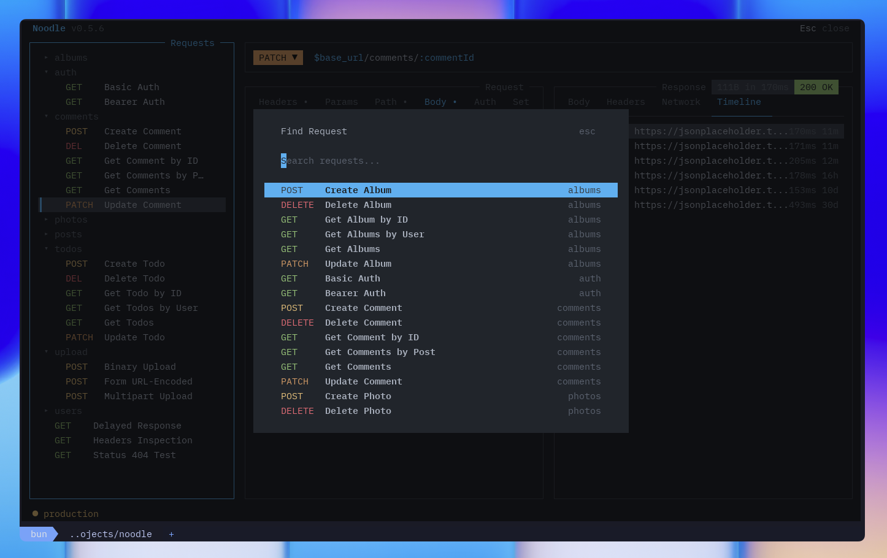
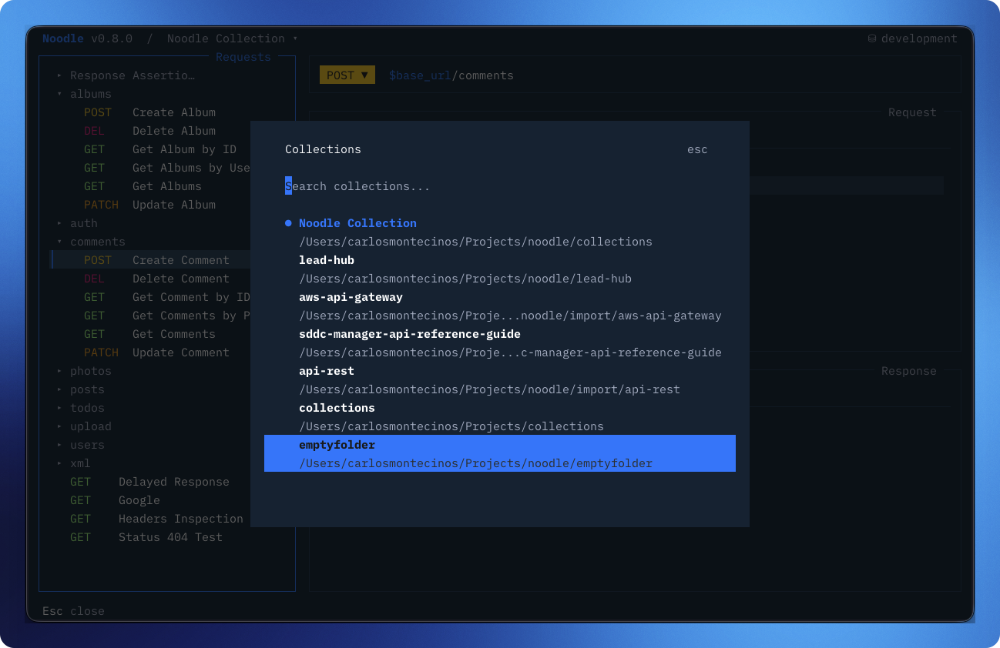

import { Image } from "astro:assets";
import noodleCatppuccin from "../../../../assets/noodle-catppuccin.png";

The sidebar is the control center. Select a request or folder, then act
on it.

<Image
  src={noodleCatppuccin}
  alt="Sidebar"
  loading="eager"
  fetchpriority="high"
/>

## Navigation

| Key                     | Action                                |
| ----------------------- | ------------------------------------- |
| **↑**/**↓**             | Move between items                    |
| **→**                   | Expand folder                         |
| **←**                   | Collapse folder                       |
| **Space**               | Toggle folder open/closed             |
| **Return**              | Select request                        |
| **Tab** / **Shift+Tab** | Move focus to another pane            |
| **Escape**              | Return focus to sidebar from anywhere |

## Requests

Requests show a method badge (GET/POST/etc.) and a dirty indicator
(●) when there are unsaved changes.

| Key             | Action                                                        |
| --------------- | ------------------------------------------------------------- |
| **Ctrl+N**      | New request: opens a modal for name, folder, method, and URL  |
| **Ctrl+K**      | Clone selected request                                        |
| **Ctrl+E**      | Edit request name, method, URL, or move to another folder     |
| **Ctrl+Alt+E**  | Edit raw YAML in the [code editor](/docs/guides/code-editor/) |
| **Ctrl+W**      | Delete selected request with confirmation                     |
| **Ctrl+Return** | Send the selected request                                     |
| **Ctrl+S**      | Save current request to disk                                  |

## Mouse Interaction

Click a request or folder to select it and focus the sidebar. Right-click a
request or folder to open its context menu. You can also click tabs, fields,
controls, and overlay actions throughout the TUI; hover styling indicates
available mouse actions.

In the environment editor, right-click an environment in its sidebar to open
the save, create, clone, and delete menu for that environment.

## Finding Requests and Folders

Press **Ctrl+F** to search every request and folder in the collection.
The finder matches names, IDs, and resolved URLs with fuzzy matching.
When an environment is active, URL results include values after
`$VARIABLE` references are resolved. Choose a result with **Return** to
reveal and select it.

## Collection Switcher

Press **Ctrl+O** to switch between previously-used collection directories
at runtime. Collections are listed in most-recently-used order and persisted
to `~/.config/noodle/config.yml`. You can also click the collection path in
the header to open the switcher.

## Folders

| Key            | Action                                                        |
| -------------- | ------------------------------------------------------------- |
| **Ctrl+Alt+N** | New folder                                                    |
| **Ctrl+W**     | Delete folder and all requests inside                         |
| **←**/**→**    | Switch folder pane tabs (General / Headers / Auth / Activity) |
| **Ctrl+Alt+E** | Edit raw `folder.yml` in the code editor                      |

## Folder Pane

When a folder is selected, the folder pane shows four tabs:

- **General**: folder name and sort order
- **Headers**: headers inherited by child requests
- **Auth**: auth config inherited by child requests
- **Activity**: per-request stats (OK%, avg time, last sent)

Headers and auth set on a folder apply to all requests inside it.

## Environments

Press **e** to search and activate an environment, or click the environment
indicator in the header. Press **F3** to open the full environment editor;
**Escape** returns to the main view.
