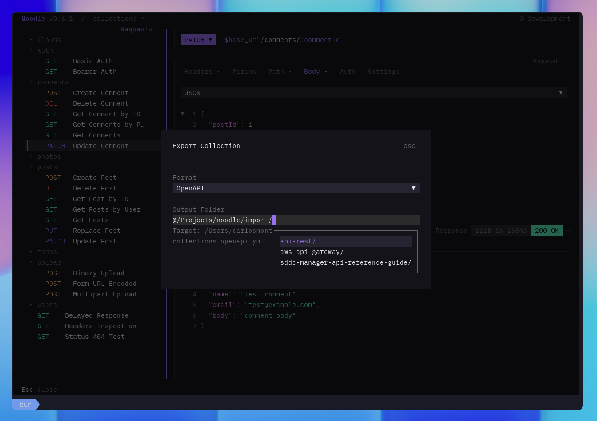

Convert an OpenAPI, Swagger, Postman, or Insomnia export into editable Noodle
requests. You need the source file on disk. In the TUI, start from an initialized
collection; the CLI can create the imported collection directly.

## Import in the TUI

1. Open a collection, press **Ctrl+P**, and choose **Import Collection**.
2. Enter the export path in **Source File**. The format is detected automatically.
3. Choose **New collection** or **Current collection** as the **Destination**.
   For a new collection, choose a **Parent Folder** outside the current collection.
   Save all pending changes before importing into the current collection.
4. Press **Ctrl+S** to import.

The current collection reloads after a successful import. A new collection is
saved in a folder named from the source collection and added to **Ctrl+O**.
Existing destination files are protected: resolve any reported path conflicts
before trying again.



## Import from the CLI

Use `noodle import` to convert supported API descriptions and collections into
Noodle `.yml` requests. The format is detected from the source file when
possible; pass `--format` to choose it explicitly.

```bash
noodle import ./api.yaml --output ./collections
noodle import ./collection.json --format postman --output ./collections
```

The command prints the created directory under `./collections`. Open that exact
directory with `noodle <printed-path>`, then follow the checks below.

## OpenAPI 3.0

```bash
noodle import ./openapi.json --format openapi
```

Noodle creates one request per operation, groups tagged operations into folders,
and imports supported parameters, request bodies, authentication, and servers.
OAuth 2.0 authorization code, client credentials, implicit, and password flows
retain their endpoints, scopes, and generated credential placeholders.
`openIdConnect` schemes import as OAuth 2 with an exact discovery-document URL.
The grant defaults to authorization code unless `x-noodle-oauth2-grant-type`
specifies another supported grant; `x-noodle-oauth2-discovery-url-kind` preserves
Noodle issuer semantics during a round-trip. OpenAPI 3.0 does not represent
OAuth 1.0a.

## Swagger 2.0

```bash
noodle import ./swagger.yaml --format swagger
```

Supported paths, parameters, request bodies, security definitions, tags, and
server details become Noodle requests, folders, and environments.

## Postman

```bash
noodle import ./postman_collection.json --format postman
```

Noodle preserves supported requests, folders, auth, headers, query parameters,
body types, and collection variables. Pre-request scripts, post-response
scripts, and tests are not imported.
OAuth 1.0a and OAuth 2.0 configuration map to Noodle's matching auth types;
review imported signing methods, grant types, endpoints, and token placement.

## Insomnia

```bash
noodle import ./insomnia-export.json --format insomnia
```

Insomnia v4 and v5 JSON exports preserve supported workspaces, request groups,
requests, environments, headers, parameters, body types, and auth. Cyclic
request groups are skipped.
Supported OAuth 1.0a and OAuth 2.0 fields map to Noodle's matching auth types.

## After import

Import canonicalizes request YAML and pretty-prints valid JSON bodies. Inspect
the new collection, then:

1. Review the import summary and the format limitations above.
2. Select an [environment](/docs/guides/using-environments/) and resolve required variables.
3. Move credentials into secret declarations and check [authentication](/docs/guides/authentication/).
4. Send a known request and compare its status and body with the original tool.
5. Recreate unsupported scripts or tests explicitly before using the [Runner](/docs/guides/collection-runner/).
