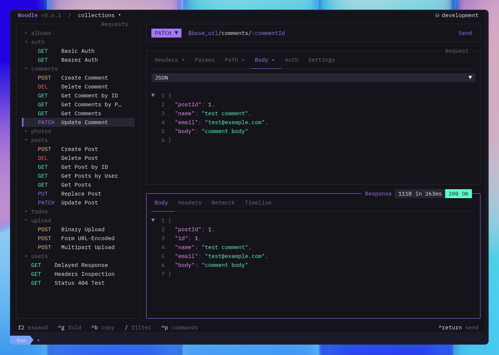

Noodle keeps HTTP work close to the code it belongs with. Requests live as YAML
files, environments remain portable, and the terminal gives you one place to
edit, send, inspect, and repeat.

## Start with one request

If Noodle is not installed yet, begin with [Installation](/docs/getting-started/installation/).
Then follow the [Quick Start](/docs/getting-started/quick-start/) to create a
collection, save a request, and inspect its first response. The whole path takes
only a few minutes and leaves you with real files you can keep.

Read [Concepts](/docs/getting-started/concepts/) when you want the mental model
behind collections, folders, environments, focus, and the command palette. The
[CLI guide](/docs/getting-started/cli/) covers everything you can launch outside
the TUI. Continue to [Automation](/docs/guides/automation/) when a collection
needs to run in scripts, CI jobs, or coding-agent workflows.

## Settle into the workspace

The interface is built around a short loop: choose a request in the
[sidebar](/docs/guides/using-the-sidebar/), edit it in the
[request pane](/docs/guides/using-the-request-pane/), and inspect the result in
the [response pane](/docs/guides/using-the-response-pane/). The
[layout guide](/docs/reference/layout/) explains how focus moves between them.

Once that loop feels natural, add [environments](/docs/guides/using-environments/)
for reusable values, [folders](/docs/guides/using-folders/) for structure and
inheritance, and [authentication](/docs/guides/authentication/) for protected
APIs. The [code editor](/docs/guides/code-editor/) guide covers larger JSON,
XML, and YAML edits.

## Bring existing work with you

You do not need to rebuild an existing API collection by hand. Noodle can
[import collections](/docs/import/import/) from OpenAPI, Swagger, Postman, and
Insomnia, then [export collections](/docs/import/export/) as OpenAPI or Postman
when another tool needs them.

## Keep the reference close

Use the reference pages when you need an exact answer rather than a walkthrough:

- [Keybindings](/docs/reference/keybindings/) for every default shortcut
- [Collection format](/docs/reference/collection-format/) for request, folder, and settings YAML
- [Environment format](/docs/reference/environment-format/) for dotenv and secure-value rules
- [Timeline](/docs/reference/timeline/) for stored response history
- [Configuration](/docs/reference/configuration/) for global settings
- [Themes](/docs/reference/theming/) for the available color schemes
