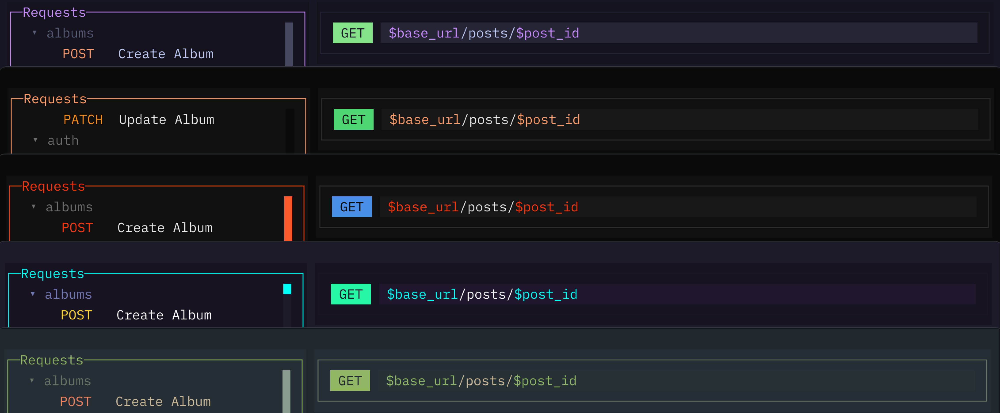

import { Image } from 'astro:assets';
import noodleRosepine from '../../../../assets/noodle-rosepine.png';

Noodle ships with **33 built-in themes** and uses the Noodle theme by default
when no theme is saved. Press **Ctrl+T** to open the theme picker and browse
available options.

<Image src={noodleRosepine} alt="Theming" loading="eager" fetchpriority="high" />

Themes cover all UI elements: panes, borders, text, selection, sidebar
badges, status bar, and dialog overlays.

## Available Themes

opencode &middot; catppuccin &middot; catppuccin-frappe &middot; catppuccin-macchiato
&middot; dracula &middot; nord &middot; tokyonight &middot; gruvbox &middot; ayu
&middot; monokai &middot; solarized &middot; onedark &middot; aura &middot; everforest
&middot; kanagawa &middot; rosepine &middot; material &middot; carbonfox
&middot; synthwave84 &middot; cobalt2 &middot; cursor &middot; flexoki &middot; github
&middot; matrix &middot; mercury &middot; nightowl &middot; noodle &middot; orng &middot; osaka-jade
&middot; palenight &middot; vercel &middot; vesper &middot; zenburn
